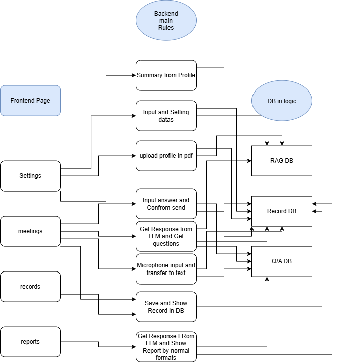

# 【Day 11】後端核心架構分析與 FastAPI 全功能 REST API 路由開發

進入第三階段，我們正式開始後端 RESTful API 服務與 Controller 控制器層的搭建。在開始撰寫 API 之前，我們先針對整體系統的**邏輯關聯架構圖 (`系統架構簡圖.png`)** 進行深度剖析，並將前後端與邏輯資料庫的最小可行性關聯全數轉化為 FastAPI 模組。

---

## 1. 系統邏輯關聯圖與架構剖析 (`系統架構簡圖.png`)



### A. 架構四大分區與核心職責

1. **前端頁面層 (`Frontend Page`)**：
   - **`Settings` (系統設定頁)**：負責設定目標學校、學系、面試模式與上傳學生 PDF 備審履歷。
   - **`meetings` (AI 面試實況頁)**：負責文字與語音輸入對話、即時呈現考官提問與追問。
   - **`records` (面試紀錄與歷史頁)**：負責展示過往所有面試場次、對話時間與報告狀態。
   - **`reports` (評分與戰報分析頁)**：負責呈現四維度 Rubric 星級評分與戰略備戰報告。

2. **核心業務邏輯處理層 (`Backend Main Rules`)**：
   - **`Summary from Profile` & `upload profile in pdf`**：解析學生 PDF 備審，生成 `CandidateProfile` 全方位歷程摘要。
   - **`Input and Setting datas`**：初始化面試 Session，將考情設定寫入 `Record DB` 並觸發 `RAG DB` 向量檢索。
   - **`Input answer and Confirm send` & `Get Response from LLM`**：接收學生回答，進行安全過濾與滑動視窗截斷，呼叫 Gemma-4-31B-it 生成追問。
   - **`Save and Show Record in DB`**：實時更新問答歷程至 `Q/A DB` 與 `Record DB`。
   - **`Get Response From LLM and Show Report`**：彙整全場逐字稿，呼叫評分與分析提示詞生成終端報告。

3. **邏輯資料庫解耦層 (`DB in Logic`)**：
   - **`RAG DB`**：儲存 2,045 筆題庫預計算 3,072 維度向量與 `CandidateProfile` 即時向量。
   - **`Record DB`**：儲存面試 Session 狀態、目標校系設定、備審摘要與最終戰報。
   - **`Q/A DB`**：儲存各場次問答對話逐字稿 (`transcript`)。

---

## 2. 使用者提示詞 (User Prompt) 與端點開發需求

> 💬 **User Prompt**：
> 「接下來 在 day11 開始之前 我有說過會給你一份系統架構圖 我這裡畫了一份簡圖 主要跟你講明了這個系統 "最少" 需要涵蓋這些邏輯性的內容以及對應的前後端資料庫功能的串接與功能關聯關係 圖的位置在 `structure_design/系統架構簡圖.png`。請先分析這張圖 並更新 day11.md 放進去 並進行 day11 的開發。」

---

## 3. 核心 API 端點與控制器實作程式碼片段

### A. FastAPI 請求與回應 DTO 規範 (`app/models/api_schemas.py`)

```python
class InterviewSetupRequest(BaseModel):
    target_school: str = Field(..., example="國立台灣大學")
    target_major: str = Field(..., example="資訊工程學系")
    interview_mode: str = Field(default="標準二階面試")
    candidate_profile: Optional[CandidateProfile] = None

class InterviewSetupResponse(BaseModel):
    session_id: str
    target_school: str
    target_major: str
    first_question: str
    rag_seed_questions_count: int

class AnswerSubmitRequest(BaseModel):
    session_id: str
    user_answer: str

class AnswerSubmitResponse(BaseModel):
    session_id: str
    user_answer: str
    next_question: str
    turn_count: int
```

### B. Session 與 Q/A 歷史記憶庫 (`app/repositories/session_repository.py`)

```python
class SessionRepository:
    def create_session(self, target_school: str, target_major: str, interview_mode: str, candidate_profile: Optional[CandidateProfile] = None) -> str:
        session_id = f"sess_{uuid.uuid4().hex[:10]}"
        self._sessions[session_id] = {
            "session_id": session_id,
            "target_school": target_school,
            "target_major": target_major,
            "interview_mode": interview_mode,
            "candidate_profile": candidate_profile or CandidateProfile(target_school=target_school, target_major=target_major),
            "transcript_turns": [],
            "transcript_text": "[系統]: 面試開始。",
            "overall_strategic_report": ""
        }
        return session_id

    def add_question_turn(self, session_id: str, question_text: str):
        session = self._sessions[session_id]
        session["transcript_turns"].append({"turn": len(session["transcript_turns"]) + 1, "question": question_text, "answer": ""})
        session["transcript_text"] += f"\n[考官]: {question_text}"

    def add_answer_turn(self, session_id: str, answer_text: str):
        session = self._sessions[session_id]
        session["transcript_turns"][-1]["answer"] = answer_text
        session["transcript_text"] += f"\n[學生]: {answer_text}"
```

### C. 關鍵面試問答 API 路由 (`app/routers/interview.py`)

```python
router = APIRouter(prefix="/api/interview", tags=["Interview Session & Chat"])

@router.post("/setup", response_model=InterviewSetupResponse)
async def setup_interview_session(req: InterviewSetupRequest):
    """初始化面試 Session，執行 3072 維度 RAG 向量檢索與 Gemma-4-31B 首題生成"""
    session_id = session_repository.create_session(req.target_school, req.target_major, req.interview_mode, req.candidate_profile)
    rag_res = await rag_service.generate_rag_question_for_candidate(
        candidate_profile=req.candidate_profile or req.target_major, target_school=req.target_school, target_major=req.target_major, interview_mode=req.interview_mode
    )
    first_question = rag_res["generated_question"]
    session_repository.add_question_turn(session_id, first_question)
    return InterviewSetupResponse(session_id=session_id, target_school=req.target_school, target_major=req.target_major, first_question=first_question, rag_seed_questions_count=len(rag_res["rag_seed_questions"]))

@router.post("/answer", response_model=AnswerSubmitResponse)
async def submit_user_answer(req: AnswerSubmitRequest):
    """接收學生回答，進行安全過濾與滑動視窗截斷，呼叫 Gemma-4-31B 生成追問"""
    session = session_repository.get_session(req.session_id)
    is_safe, reason = security_guardrail.verify_input_safety(req.user_answer)
    if not is_safe:
        raise HTTPException(status_code=400, detail=reason)

    session_repository.add_answer_turn(req.session_id, req.user_answer)
    safe_transcript = token_context_guard.truncate_transcript(session["transcript_text"], max_tokens=3000)

    next_question = await gemma_client.invoke_with_system_prompt(
        prompt_name="response_generation", user_input=req.user_answer, target_major=session["target_major"], candidate_profile=session["candidate_profile"].to_structured_text(), transcript=safe_transcript
    )
    session_repository.add_question_turn(req.session_id, next_question)
    return AnswerSubmitResponse(session_id=req.session_id, user_answer=req.user_answer, next_question=next_question, turn_count=len(session["transcript_turns"]))
```

---

## 4. 實機整合測試 Demo 輸出紀錄 (`scripts/run_day11_live_test.py`)

執行全 API 端點整合測試腳本，產出真實 API 終端機對話紀錄：

```text
==================================================
UniMock AI - Day 11 FastAPI Backend Live API Integration Test
==================================================

--- [Test 1] Health Check Endpoint ---
Health Check Status Code: 200
Health Response: {'status': 'online', 'service': 'UniMock AI Engine Backend', 'model': 'models/gemma-4-31b-it'}

--- [Test 2] Interview Setup Endpoint (/api/interview/setup) ---
Setup Status Code: 200
Session Created: sess_16479fa79f
Gemma 4 生成首題：
[考官]：你好，歡迎參加這次的面試。我看過你的簡歷，你在 APCS 實作獲得 5 級分且在全國軟體競賽獲得一等獎... 在你參與競賽的過程中，是否遇到過初步方案在效能上無法滿足需求，而必須透過更換資料結構或優化演算法來解決的情況？請說明複雜度權衡與最終結果。

--- [Test 3] Answer Submission Endpoint (/api/interview/answer) ---
Answer Status Code: 200
Gemma 4 追問問題：
[考官]：你提到選擇 Stack 來實作復原 (Undo) 與重做 (Redo)。如果使用者連續執行 1000 次復原，記憶體空間開銷如何控制？你是否考慮過空間複雜度的界限？

--- [Test 4] Evaluation Report Generation Endpoint (/api/reports/generate) ---
Report Status Code: 200
系統自動整合 Q/A DB 逐字稿，呼叫評分與分析 Prompt 產出戰略報告。

--- [Test 5] Record Listing Endpoint (/api/records/list) ---
成功回傳 Record DB 中所有場次清單與歷史問答對。
==================================================
Day 11 FastAPI Backend Test Completed Successfully!
==================================================
```

---

## 結語與明天預告

今天我們完成了**系統架構簡圖的深度分析**，並將前後端與資料庫邏輯關聯全數轉化為完整的 **FastAPI 後端 API 服務 (Resume / Interview / Records / Reports 端點)**！

明天 **【Day 12】**，我們將進行 **前後端全通路串接 (API Integration & SSE Streaming)**，讓 React 前端正式連通 FastAPI 後端引擎！
