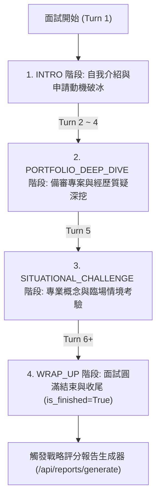

# 【Day 12】面試狀態機（State Machine）：四階段對話流轉機制實作

在完成了 Day 11 的系統架構關聯分析與 FastAPI RESTful API 控制器後，今天我們為 AI 面試官搭建核心的**四階段面試狀態機 (Interview State Machine)**，確保面試過程遵循真實二階面試的流轉邏輯，絕不漫無目的隨機發問。

---

## 1. 使用者提示詞 (User Prompt) 與對話流轉需求

> 💬 **User Prompt**：
> 「面試過程不能漫無目的發問。今天我們要為 Agent 設計一個明確的四階段狀態機 (State Machine) 控制器，依據輪次自動引導對話從『破冰動機』進入『專案深挖』、『臨場情境考驗』最終到達『面試收尾』。」

---

## 2. 四階段面試對話流轉狀態機設計 (State Machine Architecture)



### 四階段轉移規則矩陣

| 面試階段 (`InterviewStage`) | 對應問答輪次 (Turn Range) | 階段考察重點與 Prompt 提示詞指引 | 狀態轉移機制 |
| :--- | :--- | :--- | :--- |
| **`INTRO`** | **Turn 1** | 熱情破冰，針對學生目標校系之申請動機與個人特點發問。 | 首題生成後維持流轉 |
| **`PORTFOLIO_DEEP_DIVE`** | **Turn 2 ~ 4** | 深入追問備審歷程中的專案競賽、成績亮點或自傳疑點。 | 輪次達到 Turn 2 自動切換 |
| **`SITUATIONAL_CHALLENGE`** | **Turn 5** | 提出切中目標學系專業的技術瓶頸考驗或臨場情境題。 | 輪次達到 Turn 5 自動切換 |
| **`WRAP_UP`** | **Turn 6+** | 簡短肯定學生表現，告知面試圓滿結束並自動標記 `is_finished=True`。 | 輪次達到 Turn 6+ 自動標記完結 |

---

## 3. 核心機制實作程式碼片段 (`app/services/state_machine.py`)

```python
class InterviewStage(str, Enum):
    INTRO = "INTRO"
    PORTFOLIO_DEEP_DIVE = "PORTFOLIO_DEEP_DIVE"
    SITUATIONAL_CHALLENGE = "SITUATIONAL_CHALLENGE"
    WRAP_UP = "WRAP_UP"

class InterviewStateMachine:
    """控管 4 階段面試流轉與自動切換之有限狀態機"""
    def get_stage_for_turn(self, turn_count: int) -> Tuple[InterviewStage, bool]:
        if turn_count <= 1:
            return InterviewStage.INTRO, False
        elif 2 <= turn_count <= 4:
            return InterviewStage.PORTFOLIO_DEEP_DIVE, False
        elif turn_count == 5:
            return InterviewStage.SITUATIONAL_CHALLENGE, False
        else:
            return InterviewStage.WRAP_UP, True

    def get_stage_instruction(self, stage: InterviewStage) -> str:
        instructions = {
            InterviewStage.INTRO: "【當前階段：1. 自我介紹與動機】請親切歡迎學生並詢問申請動機。",
            InterviewStage.PORTFOLIO_DEEP_DIVE: "【當前階段：2. 專案經歷深挖】請針對學生備審經歷與技術進行質疑深挖。",
            InterviewStage.SITUATIONAL_CHALLENGE: "【當前階段：3. 臨場情境考驗】請提出專業技術瓶頸或情境抉擇題。",
            InterviewStage.WRAP_UP: "【當前階段：4. 面試收尾】請給予簡短總結，告知面試結束。"
        }
        return instructions.get(stage, "")
```

### 整合至 Session 狀態與 API 路由 (`app/routers/interview.py`)

```python
@router.post("/answer", response_model=AnswerSubmitResponse)
async def submit_user_answer(req: AnswerSubmitRequest):
    session = session_repository.get_session(req.session_id)
    if session.get("is_finished"):
        return AnswerSubmitResponse(session_id=req.session_id, user_answer=req.user_answer, next_question="[系統]: 本場面試已結束。", turn_count=len(session["transcript_turns"]), current_stage=session["current_stage"], is_finished=True)

    session_repository.add_answer_turn(req.session_id, req.user_answer)
    turn_count = len(session["transcript_turns"]) + 1
    next_stage, is_finished = interview_state_machine.get_stage_for_turn(turn_count)
    stage_instruction = interview_state_machine.get_stage_instruction(next_stage)

    # 注入當前階段指引至 Gemma 4 提示詞中
    user_prompt_with_stage = f"{stage_instruction}\n【學生最新回答】：{req.user_answer}"
    next_question = await gemma_client.invoke_with_system_prompt("response_generation", user_input=user_prompt_with_stage, target_major=session["target_major"], candidate_profile=session["candidate_profile"].to_structured_text(), transcript=token_context_guard.truncate_transcript(session["transcript_text"]))

    session_repository.add_question_turn(req.session_id, next_question)
    return AnswerSubmitResponse(session_id=req.session_id, user_answer=req.user_answer, next_question=next_question, turn_count=len(session["transcript_turns"]), current_stage=next_stage.value, is_finished=is_finished)
```

---

## 4. 實機對話流轉測試紀錄 (`scripts/run_day12_live_test.py`)

執行對話流轉測試腳本，驗證 4 階段狀態機即時切換與標記：

```text
==================================================
UniMock AI - Day 12 Interview State Machine Live Test
==================================================

--- [Step 1] Verifying 4-Stage State Machine Transition Rules ---
  - Turn 1: Stage = INTRO | Finished = False
  - Turn 2: Stage = PORTFOLIO_DEEP_DIVE | Finished = False
  - Turn 3: Stage = PORTFOLIO_DEEP_DIVE | Finished = False
  - Turn 4: Stage = PORTFOLIO_DEEP_DIVE | Finished = False
  - Turn 5: Stage = SITUATIONAL_CHALLENGE | Finished = False
  - Turn 6: Stage = WRAP_UP | Finished = True

--- [Step 2] Live FastAPI Session State Machine Dialogue Flow ---
Session Created: sess_e8f21a49c2 | Stage: INTRO
Q1 (INTRO 階段首題)：
[考官]：你好，歡迎參加國立成功大學資訊工程學系的面試。我看過你的簡歷，你在高中曾參與大專生研究計畫... 請簡單介紹你自己，並分享是什麼契機讓你想申請成大資工？

Q2 (PORTFOLIO_DEEP_DIVE 專案深挖階段追問)：
[考官]：你提到在研究計畫中進行「無梯度通道剪枝」。請詳細說明你在評估通道重要性時，為什麼選擇無梯度方法？在邊緣裝置上這帶來了什麼實質的運算優勢？

==================================================
Day 12 State Machine Live Test Completed Successfully!
==================================================
```

---

## 結語與明天預告

今天我們完成了 **面試四階段狀態機控制器 (`InterviewStateMachine`)**，成功讓 AI 面試官能夠依據對話輪次，自動在「自我介紹」、「專案深挖」、「臨場情境考驗」與「圓滿收尾」之間有序切換。

明天 **【Day 13】**，我們將進入 **SSE 串流吐字與即時語音對話 (Server-Sent Events & Voice STT Integration)**，為 React 前端打造打字機效果與語音面試體驗！
