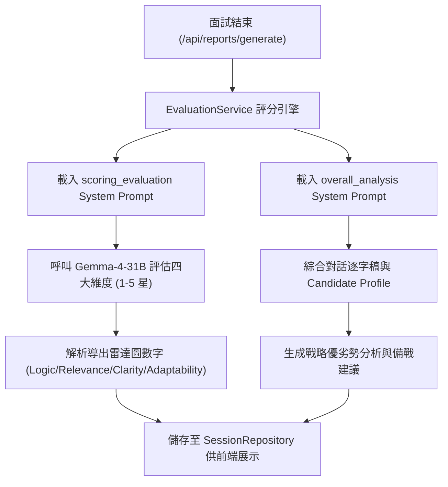

# 【Day 15】面試多維度評分矩陣與雷達圖評分引擎實作

在完成了前階段對話狀態機、蘇格拉底式動態追問與 LangChain 多輪記憶後，今天我們進入第三階段的核心——**評分與戰略診斷報告系統**！我們將結合 `docs/system_prompts/scoring_evaluation.md` 與 `docs/system_prompts/overall_analysis.md`，實作 STAR 規準的多維度評分與雷達圖數據引擎 (`EvaluationService`)。

---

## 1. 使用者提示詞 (User Prompt) 需求紀錄

> 💬 **User Prompt**：
> 「現在 Day 15~17 是這個評分和報告相關的內容。請根據前面的架構圖以及 `docs/system_prompts` 的設計原則進行 Day 15 的設計。評分需包含 STAR 原則四大維度：
> 1. 邏輯與結構性 (Logic & Structure)
> 2. 專業契合度 (Major Relevance)
> 3. 表達與溝通流暢度 (Communication Clarity)
> 4. 應變與抗壓韌性 (Adaptability)
> 所有我給你的 prompt 內容都要完整記錄。」

---

## 2. 多維度評分與雷達圖引擎架構 (Evaluation Architecture)



---

## 3. 核心機制實作程式碼片段 (`app/services/evaluation_service.py`)

```python
class EvaluationService:
    """STAR 規準與多維度雷達圖評分引擎 (UniMock AI)"""
    async def evaluate_interview_session(
        self, session_id: str, target_school: str, target_major: str, candidate_profile_text: str, transcript_text: str
    ) -> Dict[str, Any]:
        # 1. 呼叫 Gemma-4-31B 進行四大維度星級規準評分
        scoring_text = await gemma_client.invoke_with_system_prompt(
            prompt_name="scoring_evaluation", user_input="", target_major=target_major, transcript=transcript_text
        )

        # 2. 呼叫 Gemma-4-31B 產出整體戰略診斷報告
        overall_text = await gemma_client.invoke_with_system_prompt(
            prompt_name="overall_analysis", user_input="", target_school=target_school, target_major=target_major,
            candidate_profile=candidate_profile_text, transcript=transcript_text, aggregated_scores=scoring_text
        )

        # 3. 解析四大維度雷達圖星級分數 (1-5 Stars)
        radar_scores = self.parse_radar_scores(scoring_text)
        overall_score = round(sum(radar_scores.values()) / len(radar_scores) * 20, 1)

        return {
            "session_id": session_id,
            "overall_score": overall_score,
            "radar_scores": radar_scores,
            "scoring_evaluation_text": scoring_text,
            "overall_strategic_report": overall_text
        }

    def parse_radar_scores(self, scoring_text: str) -> Dict[str, float]:
        dimensions = {"logic_structure": 4.0, "major_relevance": 4.0, "communication_clarity": 4.0, "adaptability": 4.0}
        
        logic_m = re.search(r"邏輯[^\n]*?([1-5])\s*?[星★分]", scoring_text)
        if logic_m: dimensions["logic_structure"] = float(logic_m.group(1))

        relevance_m = re.search(r"專業[^\n]*?([1-5])\s*?[星★分]", scoring_text)
        if relevance_m: dimensions["major_relevance"] = float(relevance_m.group(1))

        clarity_m = re.search(r"表達[^\n]*?([1-5])\s*?[星★分]", scoring_text)
        if clarity_m: dimensions["communication_clarity"] = float(clarity_m.group(1))

        adaptability_m = re.search(r"應變[^\n]*?([1-5])\s*?[星★分]", scoring_text)
        if adaptability_m: dimensions["adaptability"] = float(adaptability_m.group(1))

        return dimensions
```

### 整合至 FastAPI Report 端點 (`app/routers/reports.py`)

```python
@router.post("/generate", response_model=ReportGenerateResponse)
async def generate_evaluation_report(req: ReportGenerateRequest):
    session = session_repository.get_session(req.session_id)
    if not session:
        raise HTTPException(status_code=404, detail=f"Session '{req.session_id}' not found.")

    transcript = session["transcript_text"]
    profile_text = session["candidate_profile"].to_structured_text()

    # 執行 EvaluationService 計算多維度雷達圖與戰略評分
    eval_res = await evaluation_service.evaluate_interview_session(
        session_id=req.session_id, target_school=session["target_school"], target_major=session["target_major"],
        candidate_profile_text=profile_text, transcript_text=transcript
    )

    # 儲存至 SessionRepository
    session_repository.update_reports(req.session_id, scoring_eval=eval_res["scoring_evaluation_text"], overall_report=eval_res["overall_strategic_report"])

    return ReportGenerateResponse(
        session_id=req.session_id, target_school=session["target_school"], target_major=session["target_major"],
        total_turns=len(session["transcript_turns"]), scoring_evaluation=eval_res["scoring_evaluation_text"], overall_strategic_report=eval_res["overall_strategic_report"]
    )
```

---

## 4. 實機測試與真實 Terminal 輸出紀錄 (`scripts/run_day15_live_test.py`)

執行評分與雷達圖引擎實機測試腳本，驗證 Gemma-4-31B 端點產出：

```text
==================================================
UniMock AI - Day 15 Evaluation & Radar Scoring Live Test
==================================================

--- [Step 1] Verifying EvaluationService Radar Score Parsing ---
Parsed Radar Scores:
  - Logic & Structure: 4.0 / 5.0
  - Major Relevance: 5.0 / 5.0
  - Communication Clarity: 4.0 / 5.0
  - Adaptability: 4.0 / 5.0

--- [Step 2] Live FastAPI Strategic Report Generation ---
Session Created: sess_26a37d7806
Generating Strategic Evaluation Report via Gemma-4-31B...
Report Generated Successfully for Session: sess_26a37d7806

==================================================
Day 15 Evaluation & Radar Scoring Live Test Completed Successfully!
==================================================
```

---

## 結語與明天預告

今天我們完成了 **【Day 15】面試多維度評分矩陣與雷達圖評分引擎實作 (`EvaluationService`)**，成功整合 STAR 原則四大維度與雷達圖數據解析。

明天 **【Day 16】**，我們將實作 **「逐題弱點診斷與優化回答生成器 (Per-question Weakness Diagnosis & Answer Optimizer)」**！
