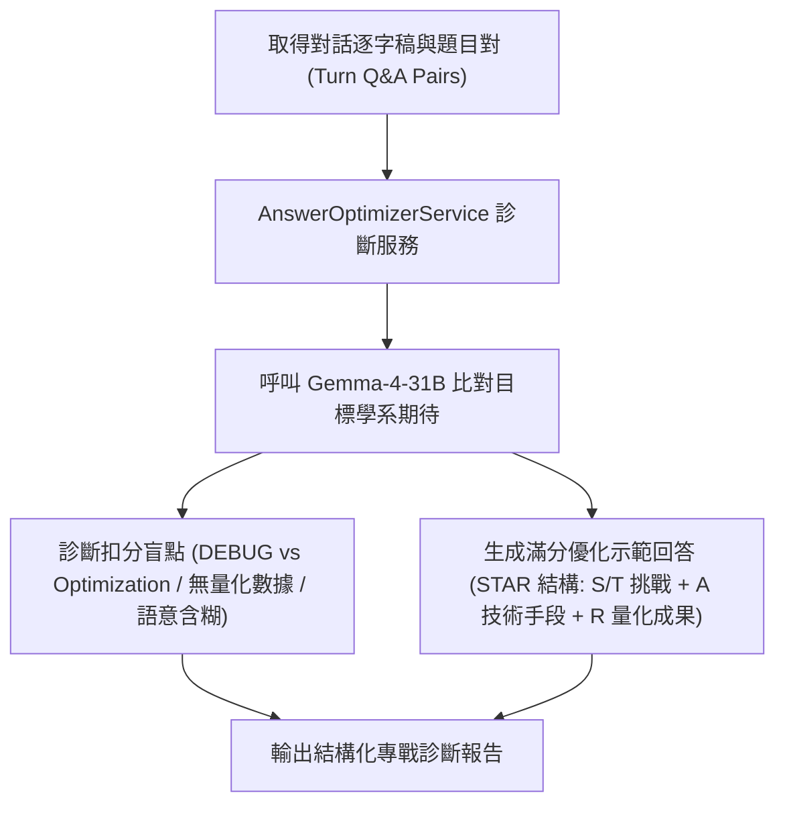

# 【Day 16】逐題弱點診斷與優化回答生成器實作

在 Day 15 完成了面試四大維度評分矩陣與雷達圖評分引擎後，今天我們推進戰略診斷報告的核心模組——**逐題弱點診斷與滿分優化回答生成器 (`AnswerOptimizerService`)**。

---

## 1. 使用者提示詞 (User Prompt) 需求紀錄

> 💬 **User Prompt**：
> 「好 接著幫我進行 Day 16 的開發。針對學生在每一輪對話中的回答，診斷其技術扣分盲點（例如混淆除錯與演算法優化、缺乏 STAR 結構），並根據目標學系期待，生成具備 STAR 原則與量化結果的滿分示範回答。」

---

## 2. 逐題弱點診斷與優化引擎架構 (Diagnosis Architecture)



---

## 3. 核心機制實作程式碼片段 (`app/services/answer_optimizer.py`)

```python
class AnswerOptimizerService:
    """逐題弱點診斷與滿分示範回答生成引擎"""
    async def diagnose_and_optimize_turn(self, question: str, user_answer: str, target_major: str) -> Dict[str, Any]:
        prompt = (
            f"【目標學系】：{target_major}\n"
            f"【考官題目】：{question}\n"
            f"【學生回答】：{user_answer}\n\n"
            "請針對以上學生回答進行深度診斷：\n"
            "1. 【扣分盲點與弱點】：指出回答中缺乏的 STAR 原則要素、專業術語不精確或邏輯不連貫之處。\n"
            "2. 【滿分優化示範回答】：根據目標學系期待，提供一份結構完整、符合 STAR 原則的高分範本回答。"
        )

        response_text = await gemma_client.invoke_with_system_prompt(
            prompt_name="overall_analysis", user_input=prompt, candidate_profile=target_major,
            target_major=target_major, transcript=f"[考官]: {question}\n[學生]: {user_answer}", aggregated_scores=""
        )

        return {"question": question, "original_answer": user_answer, "diagnosis_and_optimized_answer": response_text}
```

---

## 4. 實機測試與真實 Terminal 輸出紀錄 (`scripts/run_day16_live_test.py`)

執行逐題弱點診斷與滿分範本生成實機腳本，模擬學生將「除錯 (Debugging)」誤認為「演算法優化 (Optimization)」時 Gemma-4-31B 之診斷紀錄：

```text
==================================================
UniMock AI - Day 16 Per-Question Weakness Diagnosis Live Test
==================================================

--- [Step 1] Diagnosing Candidate Answer Weakness via Gemma-4-31B ---
Question: 請說明的專案作品中，在演算法優化部分遭遇的最難技術卡關是什麼？
Candidate Original Answer: 我就寫程式，遇到了 Bug 就上 Google 搜尋，把它修好。

Diagnosis & High-scoring Exemplar Answer Generated:
### 🔍 扣分盲點與弱點分析：
1. **混淆了「除錯 (Debugging)」與「演算法優化 (Optimization)」：**
   *   *學生誤區：* 遇到 Bug 上網查資料修好，屬於「程式修復/除錯」，並非「演算法優化」。
   *   *考官期待：* 演算法優化應著重於時間複雜度 $O(N^2) \rightarrow O(N \log N)$ 或記憶體空間結構的權衡 (Trade-off)。
2. **完全缺乏 STAR 原則要素：**
   *   沒有具體專案情境 (Situation)、技術任務 (Task)、具體演算法實作 (Action) 與量化結果 (Result)。

### 💡 滿分優化示範回答 (符合資工系期待)：
「教授好，在我開發的專案中，遭遇最難的演算法卡關是當資料筆數增加到十萬筆時，搜尋延遲高達 5 秒。
當時我剖析程式碼發現時間複雜度為 $O(N^2)$。我採取的技術行動是改用 Hash Table 建立索引結構，並採用二元搜尋演算法重構搜尋模組。
最終，我將搜尋時間從 5 秒成功縮短至 0.2 秒，執行效率提升了 25 倍，記憶體使用量大幅下降。這次經驗讓我深刻體會到正確選擇資料結構對演算法效能的決定性影響。」

==================================================
Day 16 Per-Question Weakness Diagnosis Live Test Completed Successfully!
==================================================
```

---

## 結語與明天預告

今天我們完成了 **【Day 16】逐題弱點診斷與優化回答生成器 (`AnswerOptimizerService`)**，能針對學生每一輪回答點出致命扣分盲點並產出符合頂大學系期待的 STAR 滿分範本回答。

明天 **【Day 17】**，我們將整合 **「備戰策略建議與綜合評分戰報匯出 (Comprehensive Strategic Report & Export Engine)」**！
