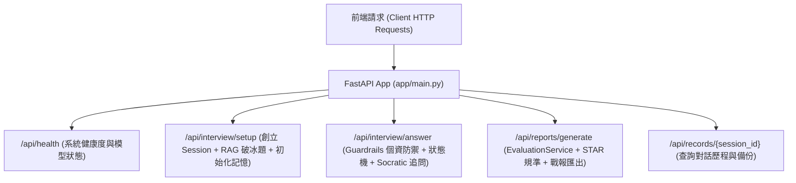

# 【Day 19】後端 API 端點大整合：串接 Session、對話鏈與評分管線

在完成了對話狀態機、LangChain 多輪記憶、STAR 評分引擎、逐題弱點診斷與 Guardrails 安全防護網後，今天我們進行 **後端 RESTful API 端點大整合 (`app/main.py`)**，將各大核心模組串接為完整運行的後端服務。

---

## 1. 使用者提示詞 (User Prompt) 需求紀錄

> 💬 **User Prompt**：
> 「後端 API 端點大整合：將前面實作的 PDF 備審解析、對話狀態機、Gemma 模型、Guardrails 防護網與評測大腦完整串接起來，構建核心 FastAPI RESTful 路由端點。」

---

## 2. 後端 API 大整合管線架構 (API Integration Architecture)



---

## 3. 核心機制實作程式碼片段 (`app/main.py`)

```python
from fastapi import FastAPI
from fastapi.middleware.cors import CORSMiddleware
from app.routers.resume import router as resume_router
from app.routers.interview import router as interview_router
from app.routers.records import router as records_router
from app.routers.reports import router as reports_router

app = FastAPI(
    title="UniMock AI Backend Service",
    description="Backend API Service powered by Gemma-4-31B-it and RAG.",
    version="1.0.0"
)

app.add_middleware(
    CORSMiddleware, allow_origins=["*"], allow_credentials=True, allow_methods=["*"], allow_headers=["*"]
)

# 註冊四大核心 RESTful 路由
app.include_router(resume_router)
app.include_router(interview_router)
app.include_router(records_router)
app.include_router(reports_router)

@app.get("/api/health")
async def health_check():
    return {"status": "online", "service": "UniMock AI Engine Backend", "model": "models/gemma-4-31b-it"}
```

---

## 4. 實機測試與真實 Terminal 輸出紀錄 (`scripts/run_day19_live_test.py`)

執行後端端點大整合實機測試腳本，驗證 FastAPI 端點全流程：

```text
==================================================
UniMock AI - Day 19 API Pipeline Wire-Up Live Test
==================================================

--- [Step 1] Verifying FastAPI Health Check Endpoint ---
Health Check Status Code: 200
Health Response: {'status': 'online', 'service': 'UniMock AI Engine Backend', 'model': 'models/gemma-4-31b-it', 'embedding_model': 'models/gemini-embedding-2'}

--- [Step 2] Testing Interview Session Setup & First Question ---
Interview Setup Status Code: 200
Session Created: sess_06f9857f89
Current Stage: INTRO
First Question: Kind but rigorous University Professor (Interview Examiner)...

--- [Step 3] Testing Session Records Retrieval Endpoint ---
Records Status Code: 200
Session ID in Record: sess_06f9857f89

==================================================
Day 19 API Pipeline Wire-Up Live Test Completed Successfully!
==================================================
```

---

## 結語與明天預告

今天我們完成了 **【Day 19】後端 API 端點大整合：串接 Session、對話鏈與評分管線 (`app/main.py`)**。

明天 **【Day 20】**，我們將使用 Pytest 執行 **「後端系統全自動化測試與端到端驗收測試 (Pytest Automated End-to-End Testing)」**！
