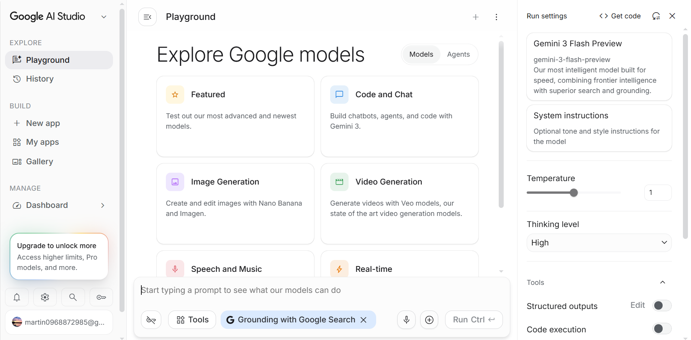
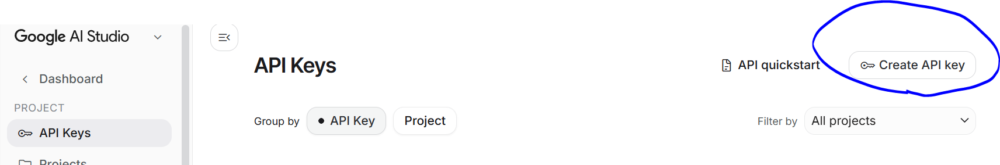
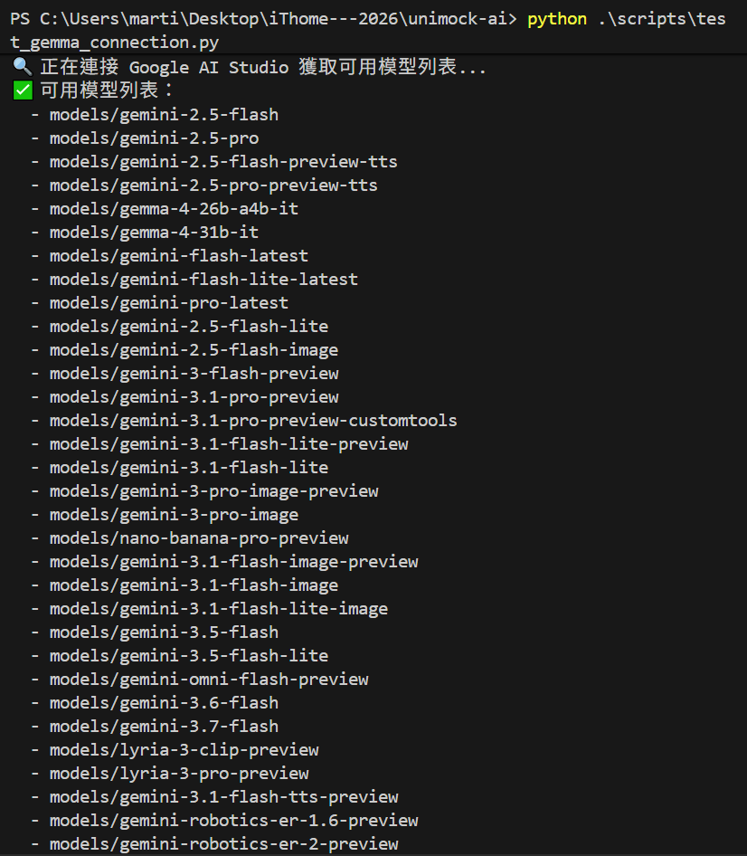
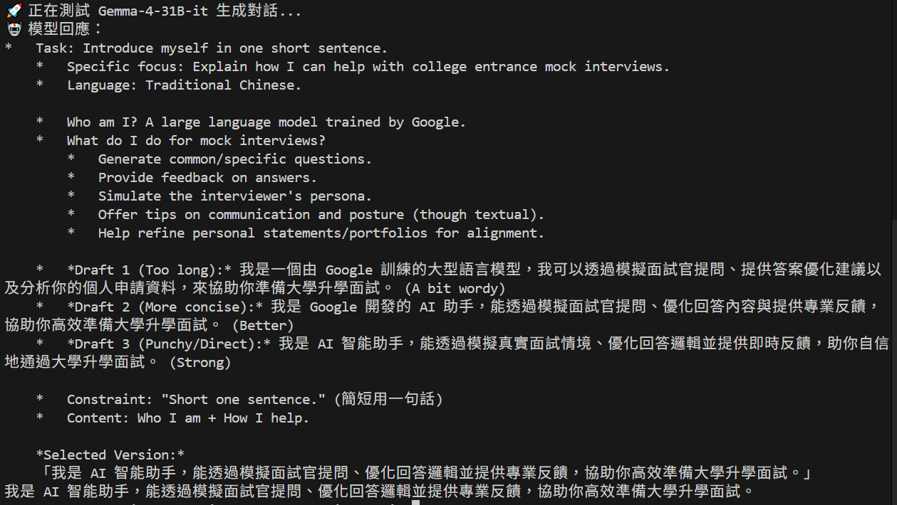

# 【Day 2】雙劍合璧：Antigravity 工作區設定與 Google AI Studio API 串接測試

大家好！在 Day 1 確定了 **UniMock AI** 的專案願景與 30 天藍圖後，今天我們要建立基礎開發環境，並完成與 **Google AI Studio** 託管模型 **Gemma-4-31B-it** 的第一支連線驗證腳本。

---

## 1. Google Antigravity 工作區初始化

我們選用 **Google Antigravity** 作為主要開發 IDE。首先在專案根目錄下建立獨立的 Python 虛擬環境並完成設定：

```bash
# 建立 Python 虛擬環境
python -m venv venv

# 啟動虛擬環境 (Windows PowerShell)
.\venv\Scripts\activate

# 升級基礎工具
python -m pip install --upgrade pip
```

---

## 2. 獲取 Google AI Studio API Key

1. 登入 [Google AI Studio](https://aistudio.google.com/)。

2. 點擊 Dashboard 後，點擊左側選單 "API key" 並建立新的金鑰。

3. 建立完成後將金鑰填入 `.env` 檔案中。

```env
GEMINI_API_KEY=your_actual_google_ai_studio_api_key
DEFAULT_MODEL_NAME=gemma-4-31b-it
DEBUG=True
```

---

## 3. Gemma-4-31B-it 通訊測試腳本

建立測試腳本 `scripts/test_gemma_connection.py` 驗證模型列表與 API 連線：

```python
import os
from dotenv import load_dotenv
import google.generativeai as genai

load_dotenv()

api_key = os.getenv("GEMINI_API_KEY")
if not api_key:
    raise ValueError("未找到 GEMINI_API_KEY，請確認 .env 檔案設定。")

genai.configure(api_key=api_key)

def verify_connection():
    print("🔍 正在連接 Google AI Studio 獲取可用模型列表...")
    models = genai.list_models()
    print("✅ 可用模型列表：")
    for m in models:
        if 'generateContent' in m.supported_generation_methods:
            print(f"  - {m.name}")

    print("\n🚀 正在測試 Gemma-4-31B-it 生成對話...")
    model = genai.GenerativeModel('gemma-4-31b-it')
    response = model.generate_content("請簡短用一句話介紹自己，並說明你如何協助大學升學模擬面試。")
    print(f"🤖 模型回應：\n{response.text}")

if __name__ == "__main__":
    verify_connection()
```

---

## 4. 驗證與執行結果

在 CMD 或 Terminal 中執行測試腳本：

```bash
python scripts/test_gemma_connection.py
```

預期產出：
- 順利列出 Google AI Studio 模型名稱。
- 模型回傳擬真回答，證明 API 串接成功。

----

執行結果如下：  


---

## 結語與明天預告

今天我們完成了 Antigravity 工作區與 Google AI Studio API 的基本連線打通。

明天 **【Day 3】**，我們將使用 **Google Stitch** 快速生成 UniMock AI 模擬面試沉浸座艙的前端原型！我們明天見！
