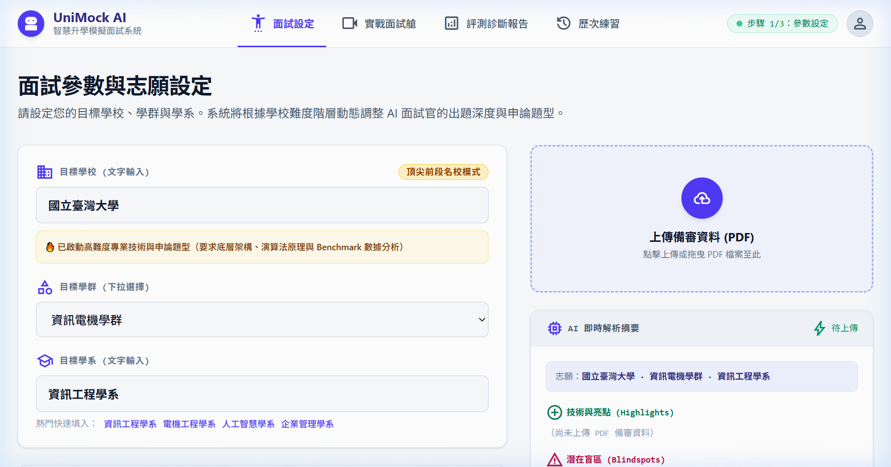
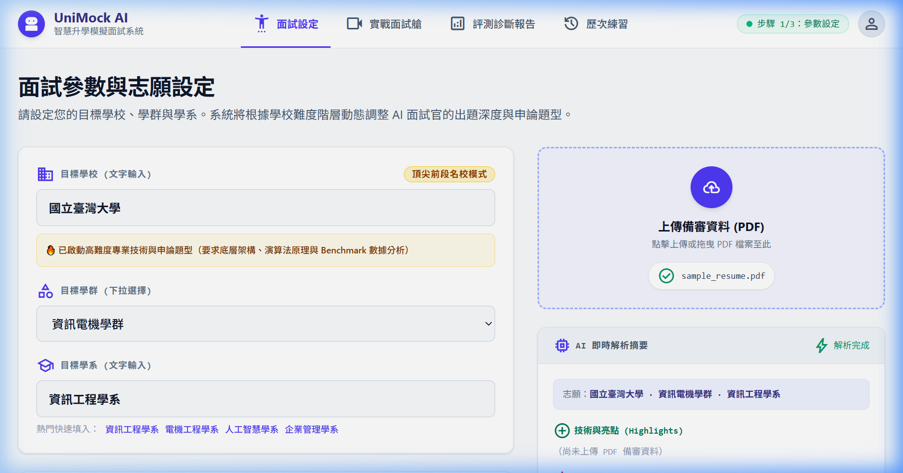
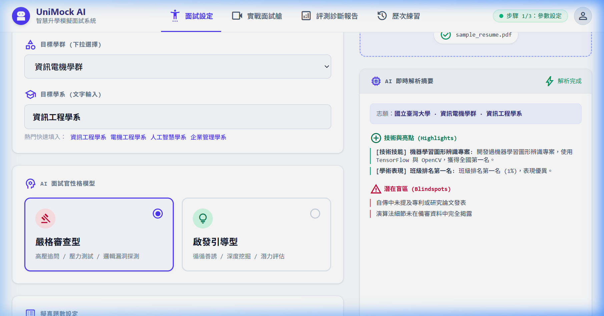
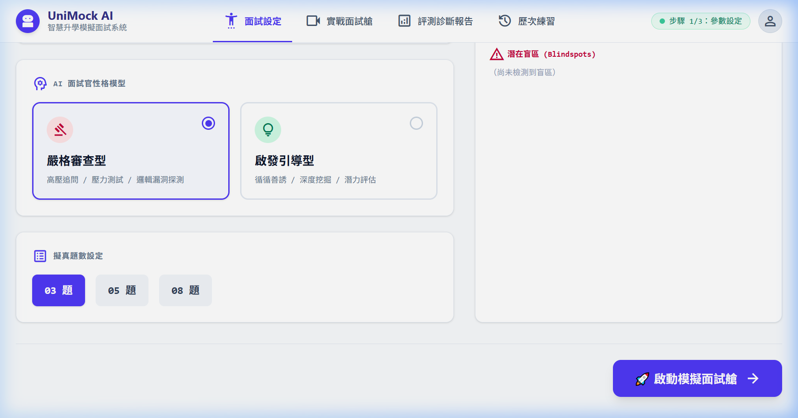
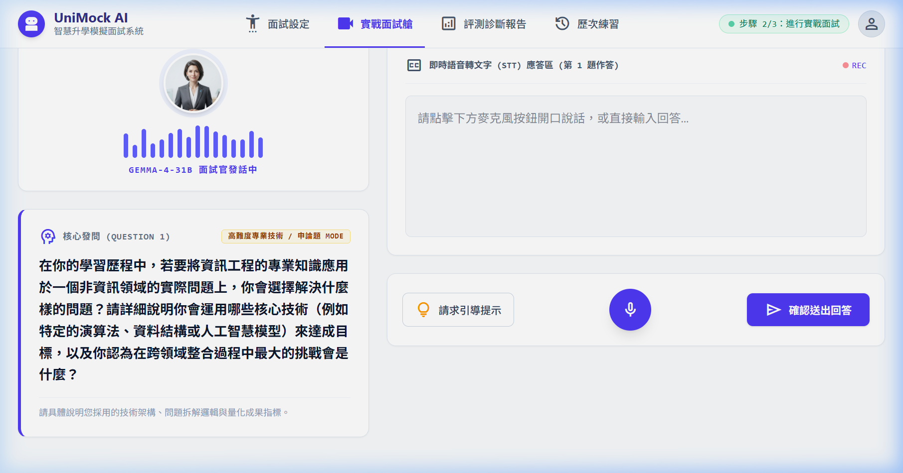
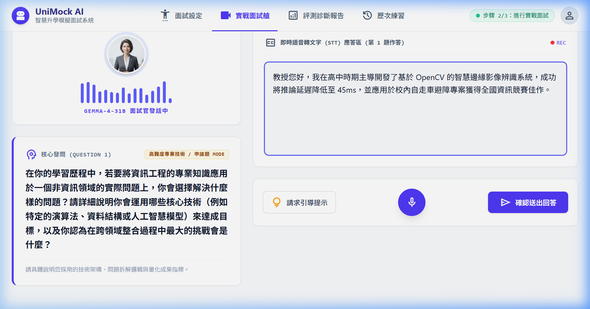
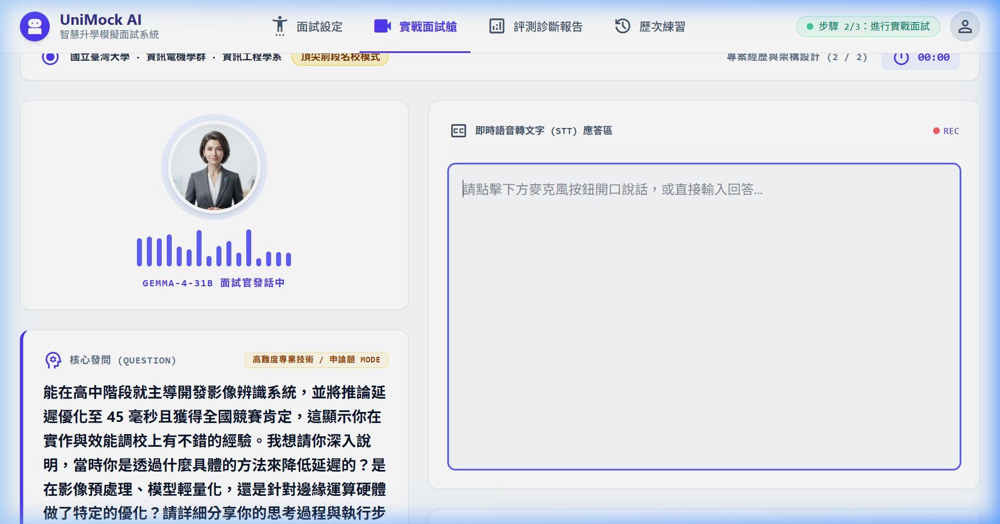

# 【Day 21】前後端接軌：FastAPI 與 React 的即時連動實戰

進入第四階段！今天我們要將前 20 天精心打造的 **FastAPI 後端服務** 與 **React 前端面試艙 UI** 正式串接起來。從上傳 PDF 備審、RAG 破冰出題到即時作答與蘇格拉底式深度追問，實現完整的前後端即時連動。

---

## 1. 核心串接流程

前端與後端的通訊非常直接，主要透過 `fetch` API 呼叫三個核心端點：

```javascript
// 1. 上傳 PDF 備審履歷 (FormData)
const uploadRes = await fetch(`${API_BASE}/resume/upload-pdf`, {
  method: 'POST',
  body: formData // 包含 PDF 檔案與目標校系
});

// 2. 啟動面試艙並獲取 RAG 動態第一題
const setupRes = await fetch(`${API_BASE}/interview/setup`, {
  method: 'POST',
  headers: { 'Content-Type': 'application/json' },
  body: JSON.stringify({ target_school: school, target_major: major })
});

// 3. 送出回答並獲取 Socratic 深度追問
const answerRes = await fetch(`${API_BASE}/interview/answer`, {
  method: 'POST',
  headers: { 'Content-Type': 'application/json' },
  body: JSON.stringify({ session_id: sessionId, user_answer: answer })
});
```

---

## 2. 串接過程中的關鍵問題與解法

在實機連動測試時，我們發現並解決了兩個影響體驗的關鍵細節：

### A. Gemma-4-31B 思考鏈 (CoT) 洩漏問題
Gemma-4-31B 在推理過程中，偶爾會在問題前輸出 markdown 清單（`* Role: ...`、`* Draft: ...`）等思維鏈內容。我們在後端 `gemma_llm.py` 中加入了 `_strip_thinking_blocks()`，精準擷取最後一段完整的繁體中文問題，確保考官輸出的純淨度。

### B. React StrictMode 打字機效果疊字
前端在模擬考官即時打字發問時，原先使用字串累加，在 React 18 的 StrictMode 下會因狀態並發導致字元重複（例如「`分分一個你你...`」）。我們改用確定性的字串切片（`text.slice(0, i)`），徹底解決了字元重複問題。

---

## 3. 實機操作與全流程連動展示

我們透過實機啟動前端（`http://localhost:5173`）與後端服務，進行完整的模擬面試流程操作：

### 步驟 1：面試參數與志願設定
設定目標學校為「國立臺灣大學 資訊工程學系」，右側履歷備審欄位保持乾淨初始狀態：



---

### 步驟 2：上傳 PDF 備審檔案與多模態解析
上傳考生的 PDF 備審歷程檔案，系統自動完成多模態結構化分析，提取歷程背景與亮點：





---

### 步驟 3：啟動模擬面試艙
點擊底部的「🚀 啟動模擬面試艙」，系統將校系設定與結構化歷程送往後端初始化面試 Session：



---

### 步驟 4：AI 考官動態第一題（破冰與專業動機）
後端 RAG 模組與 Gemma-4-31B 根據校系要求，動態生成專屬考題：



> 💬 **AI 教授發問**：  
> 「在你的學習歷程中，若要將資訊工程的專業知識應用於一個非資訊領域的實際問題上，你會選擇解決什麼樣的問題？請詳細說明你會運用哪些核心技術（例如特定的演算法、資料結構或人工智慧模型）來達成目標，以及你認為在跨領域整合過程中最大的挑戰會是什麼？」

---

### 步驟 5：考生輸入作答內容
考生在 STT 應答區中輸入符合 STAR 原則的專案作答：



> 💬 **考生作答**：  
> 「教授您好，我在高中時期主導開發了基於 OpenCV 的智慧邊緣影像辨識系統，成功將推論延遲降低至 45ms，並應用於校內自走車避障專案獲得全國資訊競賽佳作。」

---

### 步驟 6：提交作答與 Socratic 深度追問
點擊「確認送出回答」，後端狀態機推進至專案深挖階段，AI 考官根據考生的作答進行針對性的技術細節追問，上方亦同步呈現上一輪的問答摘要：



> 💬 **AI 教授深度追問**：  
> 「能在高中階段就將推論延遲優化至 45 毫秒並獲得全國競賽肯定，確實展現了不錯的實作能力。我想深入了解，為了達成這個效能目標，你在 OpenCV 的實作過程中採取了哪些具體的優化策略？此外，你當時選擇的影像辨識演算法是什麼，又是基於什麼考量而選擇它的？」

---

## 結語與明天預告

今天我們完成了前後端全鏈路的 API 整合與即時連動，成功打通了 PDF 解析、RAG 出題、作答提交與動態追問的所有環節。

明天 **【Day 22】**，我們將進一步實作 **SSE (Server-Sent Events) 打字機串流機制**，讓 AI 考官的發問能即時逐字流暢輸出，打造更具臨場感的沉浸式面試體驗！
