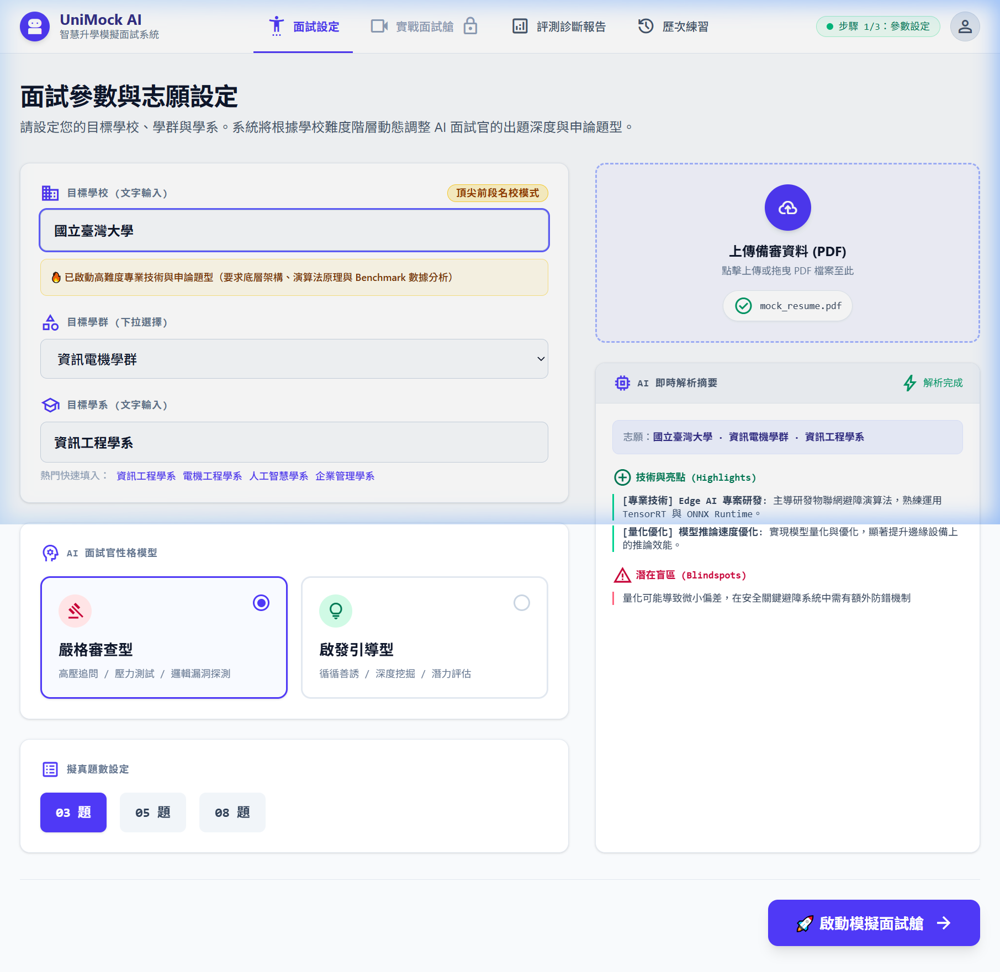
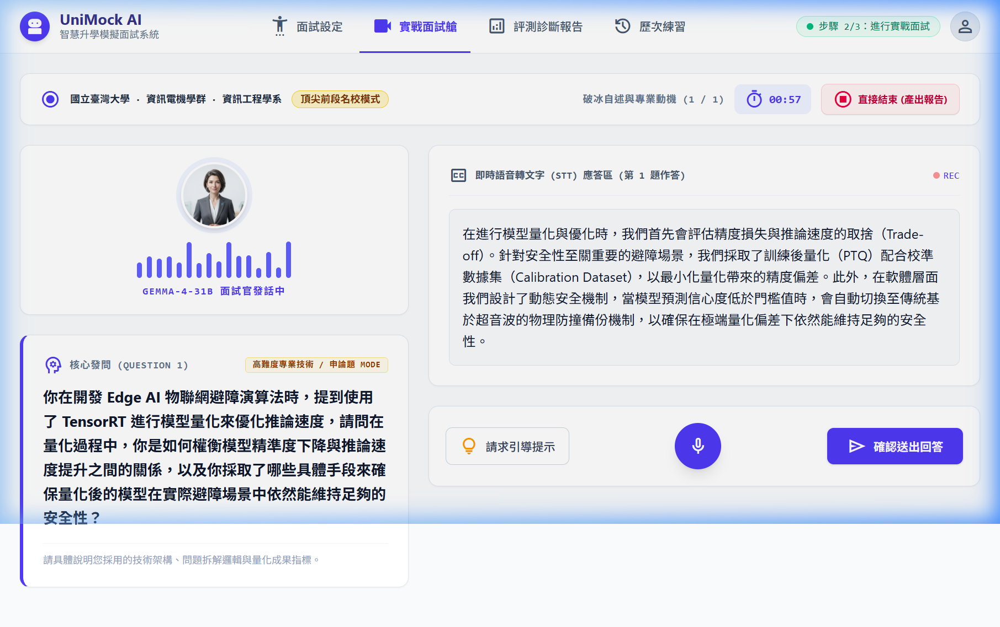
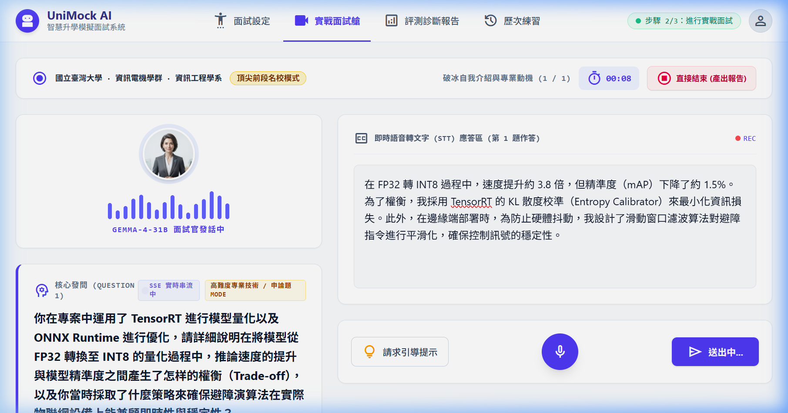
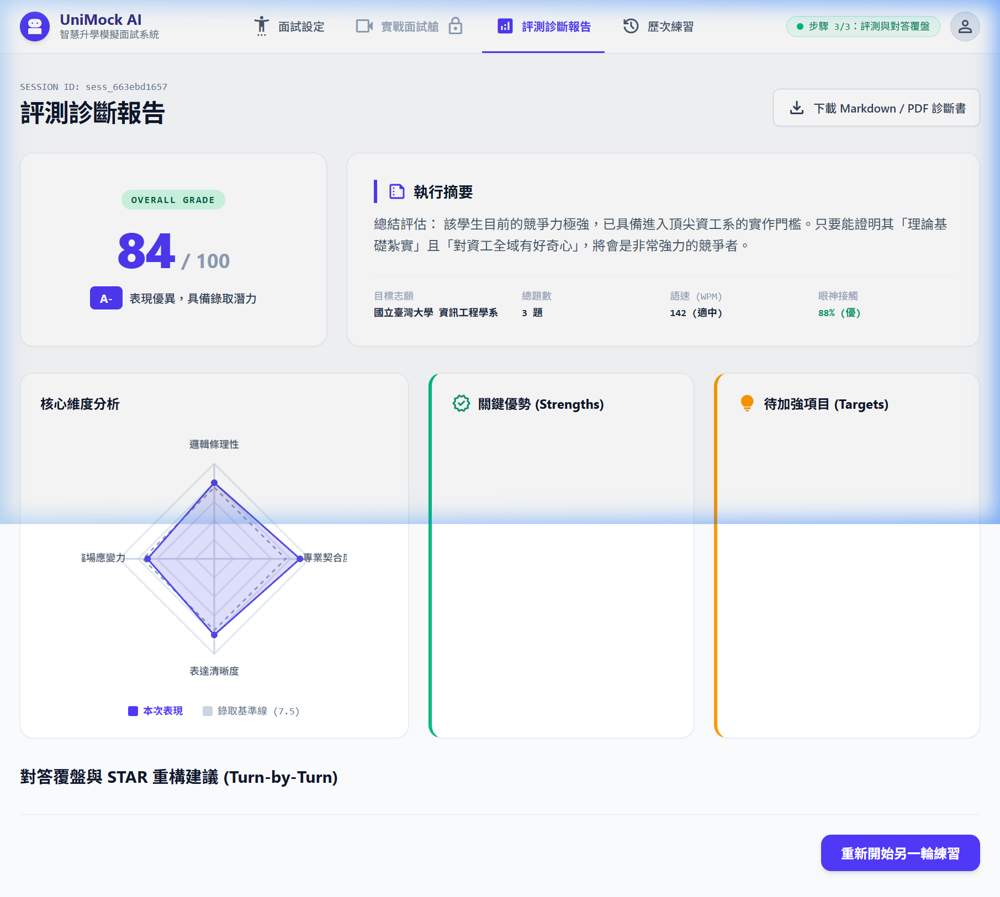
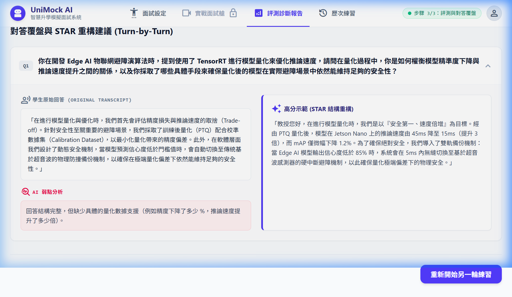

# 【Day 22】極速響應：實作 SSE (Server-Sent Events) 流式文字串流與 Markdown 格式清洗

在實作 AI 對話系統時，使用者最直觀感受到的效能指標並不是「總回答時間」，而是**首字延遲時間 (Time To First Token, TTFT)**。若等待大模型（如 Gemma-4-31B）生成整段完形語句才一次性傳回前端，使用者會面臨長達 3~5 秒的空白等待期。

今天我們實作 **SSE (Server-Sent Events)** 串流傳輸技術，讓 AI 面試官的發話能以逐字打字機（Typewriter Effect）即時串流輸出；同時針對大語言模型偶爾夾帶 Markdown 粗體語法（`**`）、標題符號（`#`）或前綴標籤（`【追問】：`）的問題，建立源頭提示詞約束與後端正則清洗機制！

---

## 1. 後端 SSE 串流端點實作 (`app/routers/interview.py`)

在 FastAPI 中，我們透過 `StreamingResponse` 搭配 `async generator` 實作非阻塞式 SSE 流式文字輸出。

```python
@router.post("/answer-stream")
async def submit_user_answer_stream(req: AnswerSubmitRequest):
    """
    接收考生回答，即時返回 Gemma-4-31B SSE 逐字串流 (text/event-stream)
    """
    session = session_repository.get_session(req.session_id)
    # ...（驗證 session 與安全 Guardrail 檢查）...

    async def sse_stream_generator():
        accumulated_text = ""
        async for token in gemma_client.astream_with_system_prompt(
            prompt_name="response_generation",
            user_input=user_prompt_with_instructions,
            target_major=session["target_major"],
            candidate_profile=session["candidate_profile"].to_structured_text(),
            transcript=safe_transcript
        ):
            accumulated_text += token
            chunk_payload = json.dumps({"text": token, "done": False}, ensure_ascii=False)
            yield f"data: {chunk_payload}\n\n"

        # 生成完成後，執行格式清洗並同步至 Memory
        clean_question = gemma_client._strip_thinking_blocks(accumulated_text)
        session_repository.add_question_turn(req.session_id, clean_question)
        
        meta_payload = json.dumps({
            "done": True,
            "full_text": clean_question,
            "is_finished": is_finished
        }, ensure_ascii=False)
        yield f"data: {meta_payload}\n\n"

    return StreamingResponse(
        sse_stream_generator(),
        media_type="text/event-stream",
        headers={"Cache-Control": "no-cache", "X-Accel-Buffering": "no"}
    )
```

---

## 2. 前端 ReadableStream SSE 接收端點 (`realApi.js`)

前端採用 HTML5 原生 `fetch` 搭配 `ReadableStream` reader 解析 `data: {...}\n\n` SSE 區塊：

```javascript
export async function respondInterviewStreamApi(sessionId, currentIdx, answer, onChunk) {
  const res = await fetch(`${API_BASE_URL}/interview/answer-stream`, {
    method: 'POST',
    headers: { 'Content-Type': 'application/json' },
    body: JSON.stringify({ session_id: sessionId, user_answer: answer })
  });

  const reader = res.body.getReader();
  const decoder = new TextDecoder('utf-8');
  let fullText = '';
  let buffer = '';

  while (true) {
    const { value, done } = await reader.read();
    if (done) break;
    buffer += decoder.decode(value, { stream: true });
    const lines = buffer.split('\n\n');
    buffer = lines.pop() || '';

    for (const line of lines) {
      if (line.trim().startsWith('data: ')) {
        const parsed = JSON.parse(line.trim().slice(6));
        if (parsed.text) {
          fullText += parsed.text;
          if (onChunk) onChunk(parsed.text, fullText);
        }
      }
    }
  }
  return { nextQuestion: fullText };
}
```

---

## 3. 根除 Markdown 殘留與前綴標籤 (CoT & Syntax Clean)

為防止 Gemma 模型輸出如 `**追問**：`、`【考官問題】：` 或 `*   Draft 1:` 等格式化殘留，我們實作了兩層防護：

### (1) Prompt 規範約束 (`response_generation.md`)
```markdown
【輸出格式嚴格規範】
- 僅直接輸出教授口說講出的下一句繁體中文純文字發話。
- 嚴禁輸出任何 Markdown 符號（如 **粗體**、# 標題、* 清單、`程式碼`）。
- 嚴禁加上前綴標籤（如【追問】、【問題】、追問：）或前後引號（「」）。
```

### (2) 後端正則自動清洗 (`gemma_llm.py`)
```python
def clean_markdown_formatting(self, text: str) -> str:
    cleaned = re.sub(r'<think>.*?</think>', '', text, flags=re.DOTALL).strip()
    # 清除星號、粗體、斜體與程式碼區塊標記
    cleaned = re.sub(r'\*\*(.*?)\*\*', r'\1', cleaned)
    cleaned = re.sub(r'`(.*?)`', r'\1', cleaned)
    # 移除前綴標籤如 【追問】：、問題：
    cleaned = re.sub(r'^(【[^】]+】|問：|問題：|追問：|考官：)\s*', '', cleaned).strip()
    # 移除全包裹的引號 「...」
    if cleaned.startswith('「') and cleaned.endswith('」'):
        cleaned = cleaned[1:-1].strip()
    return cleaned
```

---

## 4. 實機測試與系統驗證

我們啟動 Agent-Eye 進行實際瀏覽器操作與 SSE 串流連動測試：

### Step 1: 面試設定與 Resume 解析
系統自動解析考生 profile 並確認目標科系（臺大資工）：


### Step 2: 首輪問題生成（純文字無 Markdown 殘留）
第一題生成乾淨無粗體標籤的口說中文考題，考生輸入專業答題內容：


### Step 3: SSE 流式打字機即時輸出
點擊確認送出後，系統以 SSE 逐字串流產出第二題：


### Step 4: 戰略評分報告與雷達圖
面試結束後即時產出四維度評分與改善建議：


### Step 5: Turn-by-Turn STAR 診斷
點擊展開可檢視各輪答題細節與 STAR 重構建議：


---

## 結語與明天預告

今天我們成功實作了 **SSE 逐字串流技術**，並搭配提示詞與後端正則雙重過濾，確保 AI 面試官輸出純淨自然、無 Markdown 殘留符號的語句。

明天 **【Day 23】**，我們將進一步整合 Web Speech API (STT)，讓考生可以用麥克風語音實時答題！
