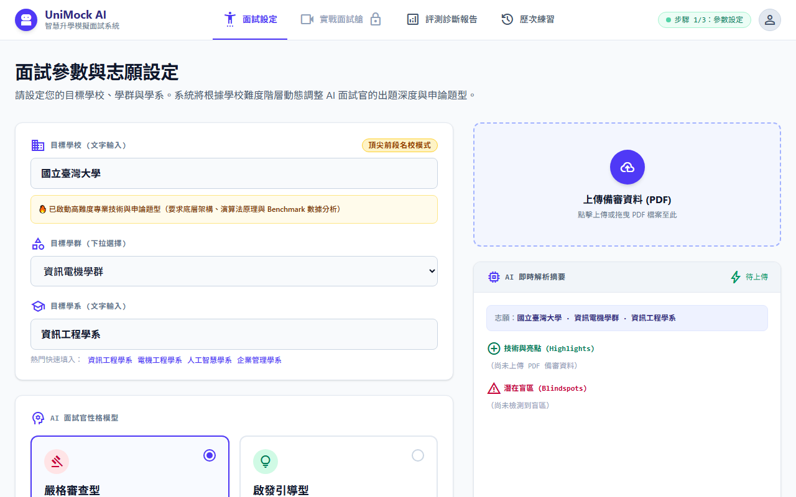

# 【Day 23】開口說話：前端整合 Web Speech API 語音輸入（STT）

真實面試是靠「口說」進行的。今天我們要整合瀏覽器原生 **Web Speech API (SpeechRecognition)**，實現即時語音轉文字（STT）輸入，讓考生可以對著麥克風直接回答 AI 面試官的問題。

---

## 1. 為什麼選 Web Speech API？

Web Speech API 是瀏覽器原生支援的語音辨識介面，**免費、零延遲、不需後端**，Chrome 支援最佳：

- `SpeechRecognition.continuous = true` → 持續收音，不自動截斷
- `interimResults = true` → 即時顯示中間辨識結果
- `lang = 'zh-TW'` → 繁體中文辨識

---

## 2. SpeechToTextEngine 模組實作

建立 `frontend/src/utils/speechToText.js`，封裝成 Class 方便在 React 的 `useRef` 中持久化使用：

```javascript
export class SpeechToTextEngine {
  constructor(onResult, onError, onEnd) {
    this.recognition = null;
    this.isListening = false;
    this.initEngine();
  }

  initEngine() {
    const SpeechRecognition = window.SpeechRecognition || window.webkitSpeechRecognition;
    if (!SpeechRecognition) return;

    this.recognition = new SpeechRecognition();
    this.recognition.continuous = true;
    this.recognition.interimResults = true;
    this.recognition.lang = 'zh-TW';

    this.recognition.onresult = (event) => {
      let transcript = '';
      for (let i = 0; i < event.results.length; i++) {
        transcript += event.results[i][0].transcript;
      }
      if (this.onResult) this.onResult(transcript);
    };
  }

  start() { this.recognition?.start(); this.isListening = true; }
  stop()  { this.recognition?.stop();  this.isListening = false; }
}
```

---

## 3. 在 InterviewPage 整合 STT

在 `InterviewPage.jsx` 用 `useRef` 持久化 engine，避免 React re-render 時重建物件：

```javascript
const sttEngineRef = useRef(null);

useEffect(() => {
  sttEngineRef.current = new SpeechToTextEngine(
    (text) => setCandidateAnswer(text),   // onResult: 即時更新 textarea
    (err)  => setIsRecording(false),       // onError: 自動停止
    ()     => setIsRecording(false)        // onEnd:   更新錄音狀態
  );
}, []);

const toggleRecording = () => {
  if (!isRecording) {
    setIsRecording(true);
    const started = sttEngineRef.current?.start();
    if (!started) simulateSpeechRecognition(); // 瀏覽器不支援時用模擬
  } else {
    setIsRecording(false);
    sttEngineRef.current?.stop();
  }
};
```

---

## 4. 實際效果展示

### 設定頁 → 啟動面試



### 進入面試艙，題目出現，等待考生口說


### STT 辨識後，語音文字即時轉填到回答區


---

## 結語與明天預告

今天我們為 UniMock AI 賦予了即時口語聽覺（STT）能力，考生只需開口就能完成回答，體驗接近真實面試現場。

明天 **【Day 24】**，我們將整合 **TTS 語音合成朗讀**，讓 AI 面試官用擬真語音發問，並連動音波動畫提供視覺反饋！
