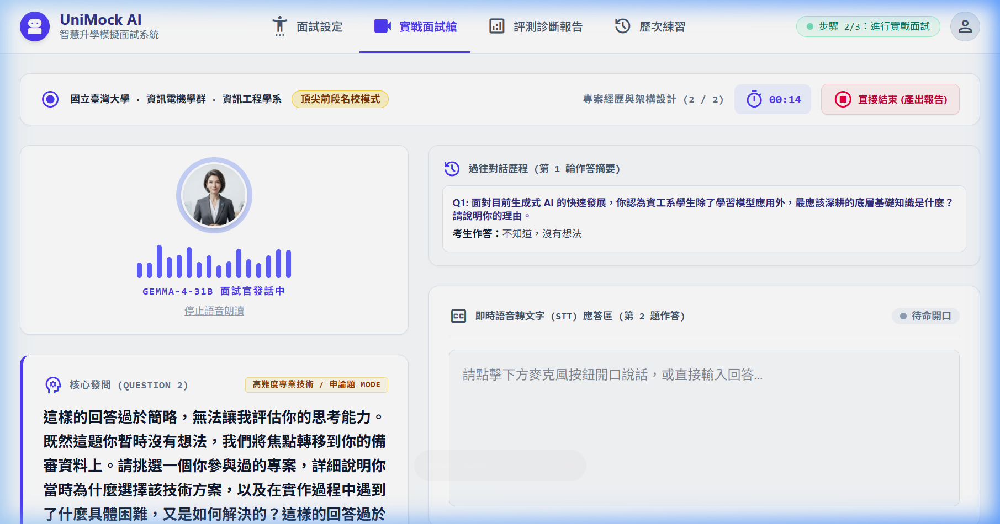
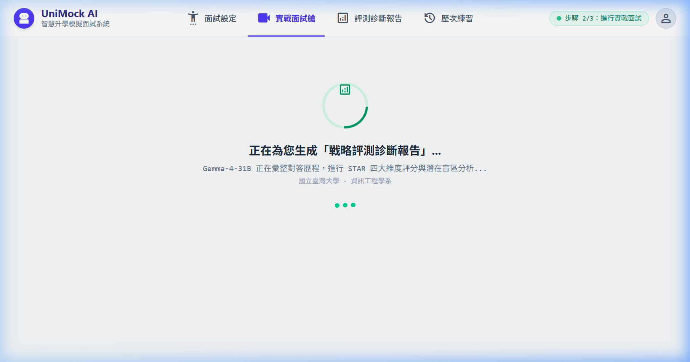

# 【Day 24】擬真面試官：整合 TTS 語音朗讀與音波動畫反饋

有了語音輸入（STT）後，今天我們要讓 AI 面試官擁有「開口說話」的能力 — 整合 **Web Speech Synthesis API (TTS)** 語音合成，並搭配 **CSS 音波擺動動畫**，給予使用者明確的「AI 正在說話」視覺反饋。

---

## 1. 為什麼需要 TTS？

純文字打字機效果只有視覺反饋，搭配 TTS 後：

- 模擬真實面試「考官開口發問」的氛圍
- 不需盯著螢幕即可理解題目（解放視覺）
- 音波動畫提供即時「正在說話」的狀態感知

---

## 2. TextToSpeechEngine 模組

建立 `frontend/src/utils/textToSpeech.js`，封裝 `SpeechSynthesisUtterance`，並加入防重複播放與非同步佇列保護：

```javascript
export class TextToSpeechEngine {
  constructor() {
    this.utterance = null;
    this.isSpeaking = false;
    this.currentText = '';
  }

  speak(text, { onStart, onEnd, onError, lang = 'zh-TW', rate = 0.95, pitch = 1.05 } = {}) {
    if (!('speechSynthesis' in window) || !text) return;
    if (this.isSpeaking && this.currentText === text) return; // ✅ 防重複觸發保護

    this.stop();
    this.currentText = text;

    const utterance = new SpeechSynthesisUtterance(text);
    utterance.lang = lang;
    utterance.rate = rate;
    utterance.pitch = pitch;

    utterance.onstart = () => { this.isSpeaking = true; if (onStart) onStart(); };
    utterance.onend   = () => { this.isSpeaking = false; this.currentText = ''; if (onEnd) onEnd(); };
    utterance.onerror = (e) => { this.isSpeaking = false; this.currentText = ''; if (onError) onError(e.error); };

    setTimeout(() => { window.speechSynthesis.speak(utterance); }, 50);
  }

  stop() {
    window.speechSynthesis.cancel();
    this.isSpeaking = false;
    this.currentText = '';
  }
}

export const ttsEngine = new TextToSpeechEngine();
```

---

## 3. 整合進 InterviewPage：打字機結束後自動朗讀與單次朗讀保護

在 React 18 元件生命週期中，為了避免 re-render 導致題目被重複念兩次，我們使用 `spokenQuestionIndexRef` 鎖定目前已朗讀的題目索引：

```javascript
import { ttsEngine } from '../utils/textToSpeech';

const spokenQuestionIndexRef = useRef(-1);

useEffect(() => {
  if (!currentQ?.text) return;
  const fullText = currentQ.text;
  setDisplayedQuestion('');

  let i = 0;
  const interval = setInterval(() => {
    i++;
    if (i <= fullText.length) {
      setDisplayedQuestion(fullText.slice(0, i));
    } else {
      clearInterval(interval);
      // ✅ 打字機結束 → 確保每題僅觸發朗讀一次
      if (spokenQuestionIndexRef.current !== currentIdx) {
        spokenQuestionIndexRef.current = currentIdx;
        ttsEngine.speak(fullText, {
          onStart: () => setIsSpeaking(true),
          onEnd:   () => setIsSpeaking(false),
          onError: () => setIsSpeaking(false),
        });
      }
    }
  }, 20);

  return () => clearInterval(interval);
}, [currentIdx, currentQ?.text]);
```

---

## 4. 關鍵體驗修正：無意義回答嚴肅處置與直接結束體驗

### 4.1 無意義回答（如「不知道、沒想法」）的 System Prompt 重構

在 `app/services/followup_agent.py` 與 `response_generation.md` 中，新增針對空白、逃避或極短無意義回答的攔截比對：

- **禁止盲目稱讚**：當考生回答「不知道，沒有想法」時，系統提示詞嚴格禁止輸出「很好/沒關係」等瞎捧用語。
- **嚴肅引導**：面試官會明確點出「該回答過於簡略，無法評估思考能力」，並主動引導考生轉由備審資料經驗切入。

### 4.2 「直接結束 (產出報告)」即時 Loading 反饋

將原先阻塞式的 `window.confirm` 改為立即無縫跳轉至專屬「診斷報告生成中」全螢幕動畫遮罩，並停止任何正在播放的 TTS 語音。

---

## 5. 實際效果展示

### 題目出爐，TTS 啟動單次朗讀（音波跳動 + 面試官發話中標籤 + 停止按鈕）


### 考生輸入「不知道，沒有想法」時，AI 面試官嚴肅專業地指回主題（絕不盲目稱讚）



### 點擊「直接結束」，立即無縫跳轉「正在為您生成戰略評測診斷報告」載入畫面



---

## 結語與明天預告

今天我們不僅實現了 TTS 語音朗讀與音波動畫，更補強了 AI 面試官面對逃避性回答時的專業立場與「直接結束」的體驗細節。

明天 **【Day 25】**，我們將整合 **Chart.js** 在前端動態渲染 STAR 多維度面試成績雷達圖！
