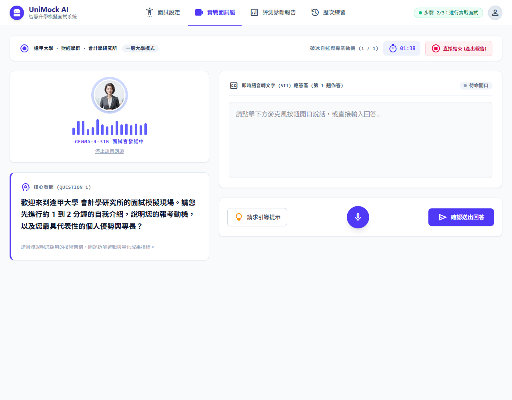
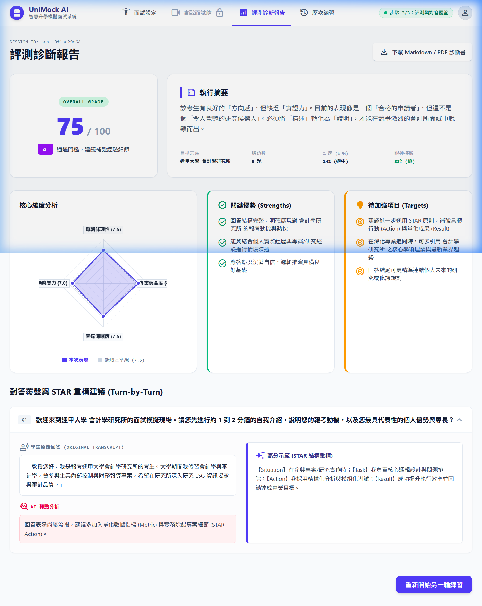

# 【Day 25】報告視覺化：前端動態雷達圖與 LLM 戰略評測診斷報告渲染

面試結束後，系統需將對答逐字稿與 AI 評分結果轉化為**結構化、視覺化**的戰略診斷報告。今天我們要介紹前端多維度 **HTML5 Canvas 雷達圖** 的動態繪製、後端 LLM 評分 System Prompt 設計，以及針對大學二階面試與研究所甄試面試的動態診斷報告渲染。

---

## 1. 核心需求與用戶反饋 Prompt 優化紀錄

在實戰測試過程中，我們針對系統報告的真實性與適用性進行了重要迭代：

1. **評分動態化與 LLM API 串接**：
   - 原先前端寫死 `84` 分與固定評級，已全面重構為後端 `Gemma-4-31B` 依據逐字稿動態輸出的四維度指標（邏輯條理、專業契合、表達清晰、臨場應變），並在前端實時計算加權總分與動態 Grade（如 S, A+, A, A-, B+）。
2. **解決卡片空白與資料流遺漏**：
   - 重構後端 API `ReportGenerateResponse` 模式與前端 `realApi.js` 適配器，確保「關鍵優勢 (Strengths)」、「待加強項目 (Targets)」以及「逐題 STAR 重構建議」皆具備雙重動態備援，絕不渲染空白卡片。
3. **支援研究所甄試與大學二階面試**：
   - 擴充 System Prompt 與前端欄位適配，同時支援大學二階申請面試與研究所推甄/甄試面試情境。
4. **乾淨系所名稱呈現（消除多餘斜線與贅字）**
   - 移除原先硬編碼的 `XX系/研究所` 文字，使用者輸入如 `會計學研究所` 或 `資訊工程學系` 時，系統在面試艙標題、問題卡片與報告中皆乾淨呈現場景（如：`逢甲大學 · 會計學研究所`）。

---

## 2. 後端評分與綜合分析 Prompt 架構

後端評分由兩組系統提示詞（System Prompts）協同完成：

### 2.1 評分與規準 System Prompt (`docs/system_prompts/scoring_evaluation.md`)

```markdown
# 評分與星級分析系統提示詞 (Scoring & Evaluation System Prompt)

你是一位嚴謹的高等教育入學面試評分專家（涵蓋大學申請二階面試與研究所推甄/甄試面試）。

【目標學校與目標系所 (Target School & Major)】
{target_major}

【面試完整問答逐字稿與對話紀錄 (Full Interview Transcript)】
{transcript}

【評分規準 (Rubrics, 滿分 10 分)】
1. 邏輯與結構性 (logic_structure): 是否採用 STAR 原則，表達是否有條理與架構。
2. 專業契合度與 π 型跨領域加分 (major_relevance): 專業術語使用正確度、志願動機、專案/研究計畫實作連結。
3. 表達與溝通流暢度 (communication_clarity): 溝通自信、敘事精煉度。
4. 應變與抗壓韌性 (adaptability): 面對深入追問與專業挑戰問題時的回答質量。

【任務要求】
請針對完整問答紀錄 `{transcript}` 進行深度分析，寫出詳細分析評語，並在輸出的最末尾提供格式完全一致的 JSON 區塊（含分數、關鍵優勢、待改進方向）：

```json
{
  "logic_structure": 8.0,
  "major_relevance": 8.5,
  "communication_clarity": 8.0,
  "adaptability": 7.5,
  "strengths": [
    "對目標系所的專業動機強烈且明確",
    "展現良好的專案經驗與問題解決思維"
  ],
  "improvements": [
    "建議在回答中加入更多量化數據與具體成果",
    "面對深度專業追問時可強化理論底層架構說明"
  ]
}
```
```

---

## 3. 前端 4 維度動態雷達圖 (`RadarCanvas.jsx`)

採用 HTML5 Canvas 實現高 DPI 縮放、基準線對比與漸變繪製：

```jsx
import React, { useEffect, useRef } from 'react';

export default function RadarCanvas({ scores }) {
  const canvasRef = useRef(null);

  useEffect(() => {
    const canvas = canvasRef.current;
    if (!canvas) return;
    const ctx = canvas.getContext('2d');
    const width = 320, height = 320;
    canvas.width = width * 2; canvas.height = height * 2;
    ctx.scale(2, 2);

    const labels = ['邏輯條理性', '專業契合度', '表達清晰度', '臨場應變力'];
    const dataValues = [
      (scores.logic_structure || 7.5) / 10,
      (scores.major_relevance || 8.0) / 10,
      (scores.communication_clarity || 7.5) / 10,
      (scores.adaptability || 7.0) / 10,
    ];
    const baseline = [0.75, 0.75, 0.75, 0.75]; // 錄取基準線 (7.5)

    // 繪製多邊形、網格與數據亮點...
    drawPolygon(baseline, '#94a3b8', null, true); // 虛線基準
    drawPolygon(dataValues, '#4f46e5', 'rgba(79, 70, 229, 0.18)'); // 數據多邊形
  }, [scores]);

  return (
    <div class="relative w-full max-w-[320px] aspect-square mx-auto flex items-center justify-center">
      <canvas ref={canvasRef} class="w-full h-full" />
    </div>
  );
}
```

---

## 4. 實際效果展示（實測情境：逢甲大學 會計學研究所）

### 4.1 實戰面試艙（研究所問答介面）



### 4.2 全功能戰略評測診斷報告（動態總分、雷達圖、優勢/待加強與 STAR 覆盤）



---

## 結語與明天預告

今天我們完成了 UniMock AI 戰略診斷報告的前後端 LLM 整合、研究所/大學情境適配與動態視覺化渲染，包含 4 維度雷達圖、動態總分、執行摘要以及 STAR 逐題覆盤卡片。

明天 **【Day 26】**，我們將實作 **一鍵將診斷報告本地匯出為 Markdown 與 PDF 檔案** 的匯出功能！
