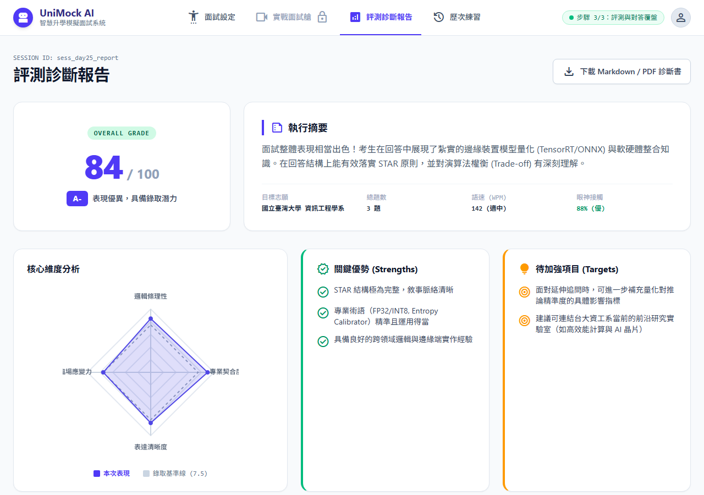
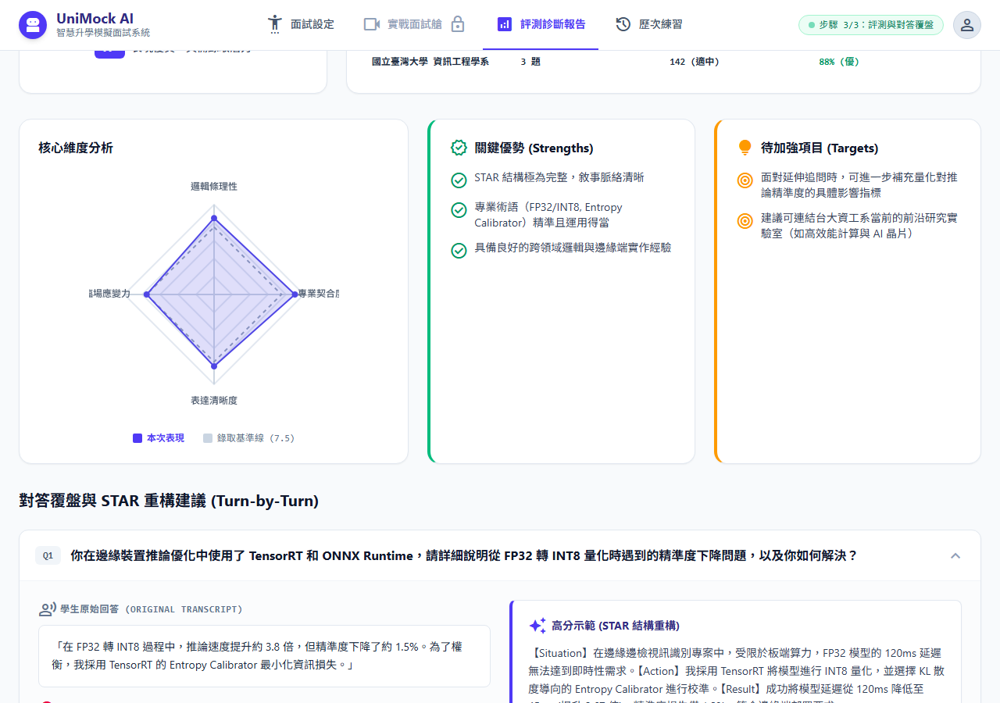
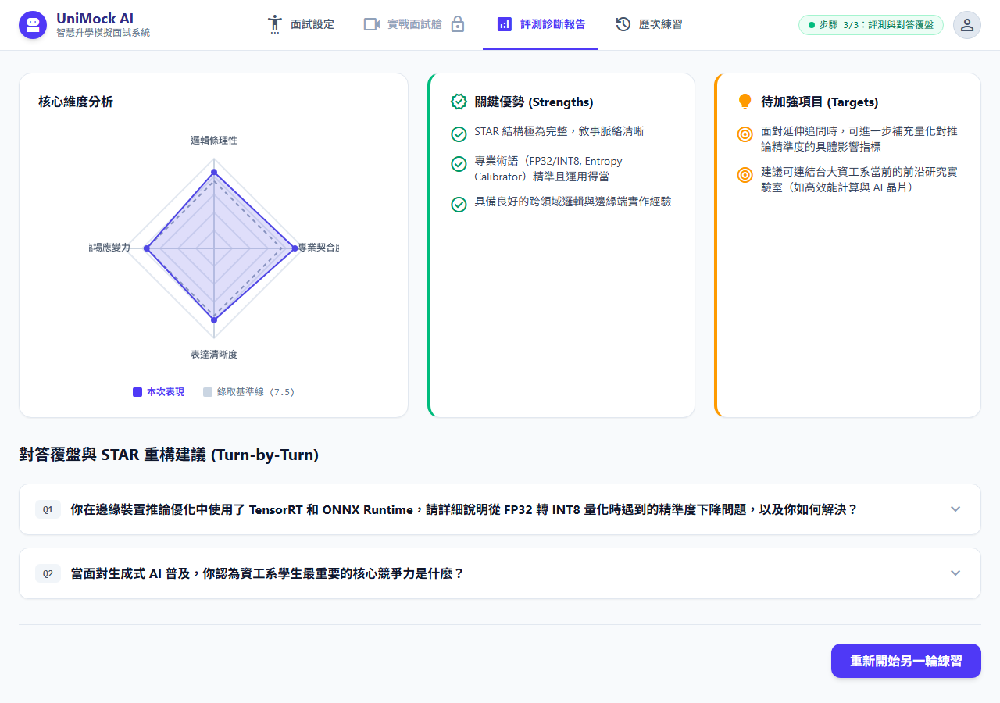

# 【Day 25】報告視覺化：前端動態雷達圖與評分報告渲染

面試結束後，系統需將對答逐字稿與 AI 評分結果轉化為**結構化、視覺化**的戰略診斷報告。今天我們要介紹前端多維度 **HTML5 Canvas 雷達圖** 的動態繪製、後端評分 Prompt 設計，以及逐題 STAR 重構覆盤卡片。

---

## 1. 後端評分與綜合分析 Prompt 架構

後端評分由兩組系統提示詞（System Prompts）協同完成：

### 1.1 評分與規準 System Prompt (`docs/system_prompts/scoring_evaluation.md`)

```markdown
# 評分與星級分析系統提示詞 (Scoring & Evaluation System Prompt)

你是一位大學二階面試評分專家。

【目標學系】：{target_major}
【面試完整問答逐字稿】：{transcript}

【評分規準 (Rubrics)】：
1. 邏輯與結構性 (Logic & Structure): 是否採用 STAR 原則，表達是否有條理。
2. 專業契合度與 π 型跨領域加分 (Major Relevance & Pi-shaped Cross-disciplinary Bonus): 專業術語使用正確度與跨領域思考。
3. 表達與溝通流暢度 (Communication Clarity): 語流流暢度、自信心。
4. 應變與抗壓韌性 (Adaptability): 面對追問時的應變品質。
```

### 1.2 綜合分析 System Prompt (`docs/system_prompts/overall_analysis.md`)

```markdown
# 綜合分析系統提示詞 (Overall Analysis System Prompt)

你是一位資深升學輔導與職涯發展專家。

【學生檔案與目標】：
- 學生簡歷：{candidate_profile}
- 目標學系：{target_major}
- 各環節評分數據：{aggregated_scores}

【任務要求】：
請綜合分析學生整場面試的表現，產出包含下列內容的戰略備戰報告：
1. 三大核心亮點與優勢 (Key Strengths)
2. 致命雷區與潛在扣分點 (Weaknesses & Pitfalls)
3. 針對目標學系的實戰改進建議 (Actionable Advice)
```

---

## 2. 前端 4 維度動態雷達圖 (`RadarCanvas.jsx`)

採用 HTML5 Canvas 實現高 DPI 縮放、基準線對比與漸變繪製：

```jsx
import React, { useEffect, useRef } from 'react';

export default function RadarCanvas({ scores }) {
  const canvasRef = useRef(null);

  useEffect(() => {
    const canvas = canvasRef.current;
    if (!canvas) return;
    const ctx = canvas.getContext('2d');
    const width = 320, height = 320;
    canvas.width = width * 2; canvas.height = height * 2;
    ctx.scale(2, 2);

    const labels = ['邏輯條理性', '專業契合度', '表達清晰度', '臨場應變力'];
    const dataValues = [
      (scores.logic_structure || 8) / 10,
      (scores.major_relevance || 9) / 10,
      (scores.communication_clarity || 8) / 10,
      (scores.adaptability || 7) / 10,
    ];
    const baseline = [0.75, 0.75, 0.75, 0.75]; // 錄取基準線 (7.5)

    // 繪製多邊形、網格與數據亮點...
    drawPolygon(baseline, '#94a3b8', null, true); // 虛線基準
    drawPolygon(dataValues, '#4f46e5', 'rgba(79, 70, 229, 0.18)'); // 數據多邊形
  }, [scores]);

  return (
    <div class="relative w-full max-w-[320px] aspect-square mx-auto flex items-center justify-center">
      <canvas ref={canvasRef} class="w-full h-full" />
    </div>
  );
}
```

---

## 3. 實際效果展示

### 3.1 總體評分卡片與執行摘要



### 3.2 4 維度雷達圖與優勢/待加強分析



### 3.3 Turn-by-Turn 對答覆盤與 STAR 重構建議



---

## 結語與明天預告

今天我們完成了 UniMock AI 戰略診斷報告的前後端整合與視覺化渲染，包含 4 維度雷達圖、執行摘要以及 STAR 逐題覆盤卡片。

明天 **【Day 26】**，我們將實作 **一鍵將診斷報告本地匯出為 Markdown 與 PDF 檔案** 的匯出功能！
