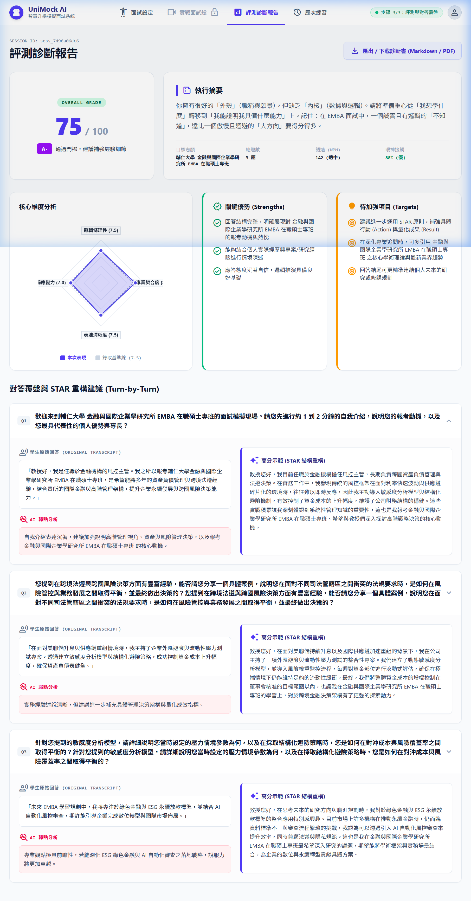
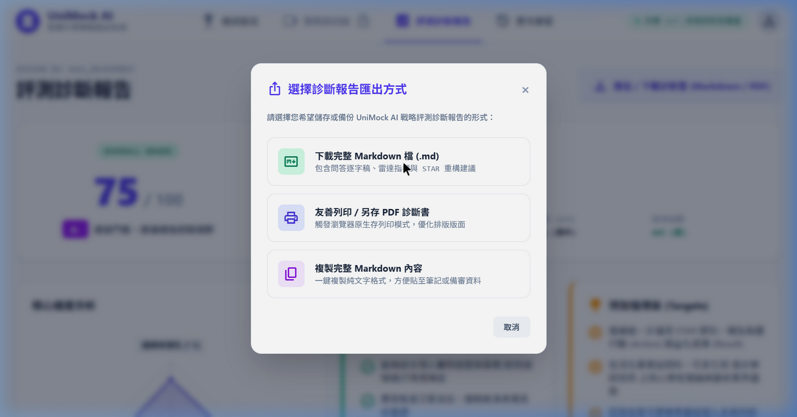
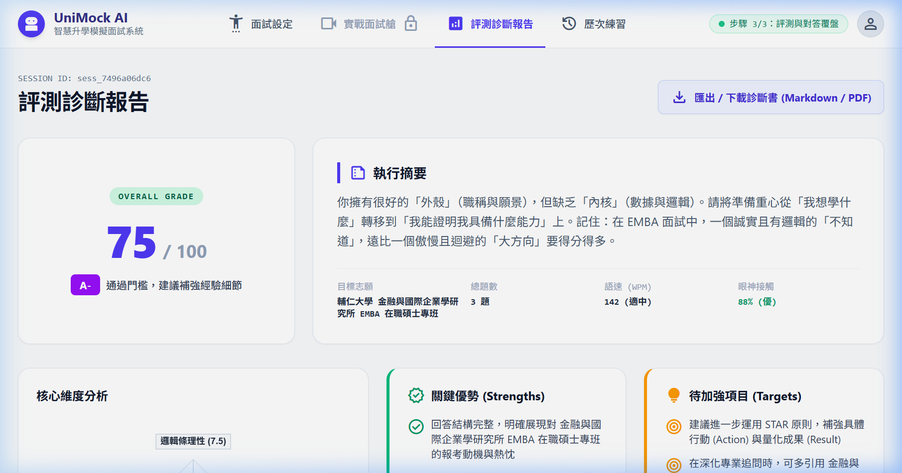
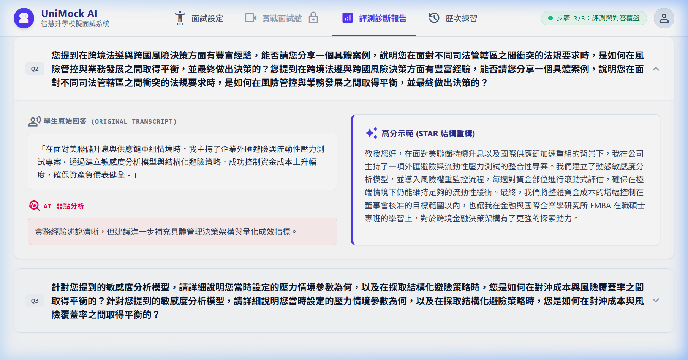

# 【Day 26】報告本地匯出：一鍵下載 Markdown / PDF 診斷書與剪貼簿複製

學生在完成面試模擬與 AI 評測後，需要將備戰診斷成果儲存留存或導入個人備審資料。今天我們要介紹 ** UniMock AI 多功能報告匯出系統** 的開發與測試，包含「**一鍵下載 Markdown (.md) 檔**」、「**觸發瀏覽器原生存列印/PDF 產出**」以及「**剪貼簿一鍵複製**」三大核心功能。

---

## 1. 核心需求與用戶 Prompt 紀錄

依據使用者需求：「*進行 Day26 的部份的開發與測試，並記錄我給你的 prompt 以及對應的內容到 md 中，測試一樣使用瀏覽器 agent 去進行操作並實際驗證前端呈現無誤後，截圖到 md 中做紀錄*」

### 🎯 開發目標與規格要點
1. **多格式匯出彈窗 (Export Options Modal)**：點擊報告頁面頂部的「匯出 / 下載診斷書」按鈕時，跳出模態彈窗供使用者選擇匯出模式。
2. **格式一：下載完整 Markdown 檔 (.md)**：自動彙整目標志願、四維度評分、執行摘要點評、關鍵優勢、待加強項目以及逐題 STAR 重構對答歷程，導出檔名如 `UniMock_Report_逢甲大學_會計學研究所.md`。
3. **格式二：友善列印與 PDF 另存 (Print / PDF)**：透過 CSS `@media print` 隱藏導覽列與按鈕等非必要 UI，專注排版列印區塊。
4. **格式三：複製 Markdown 至剪貼簿 (Copy to Clipboard)**：調用 `navigator.clipboard` API 快速複製，並彈出 Toast 提示訊息。

---

## 2. 前端匯出邏輯實作 (`ReportPage.jsx` & `index.css`)

### 2.1 戰略診斷報告 Markdown 生成器

```javascript
const generateMarkdownContent = () => {
  return `# UniMock AI 模擬面試戰略診斷報告

- **目標學校：** ${sessionData.targetSchool || '未指定'}
- **目標學群：** ${sessionData.targetGroup || '未指定'}
- **目標系所：** ${sessionData.targetMajor || '未指定'}
- **總體評分：** ${computedOverallScore} / 100 (${gradeInfo.grade} - ${gradeInfo.label})

## 核心維度分析
- **STAR 邏輯條理性：** ${scores.logic_structure} / 10
- **專業契合度：** ${scores.major_relevance} / 10
- **表達清晰度：** ${scores.communication_clarity} / 10
- **臨場應變力：** ${scores.adaptability} / 10

## 綜合點評與戰略備戰報告
${report.overall_feedback || report.overall_strategic_report || '尚無點評資訊'}

## 關鍵優勢 (Strengths)
${(report.strengths || []).map((s) => `- ${s}`).join('\n')}

## 建議改進方向 (Improvements & Targets)
${(report.improvements || []).map((i) => `- ${i}`).join('\n')}

## 逐題對答覆盤與 STAR 重構建議
${(report.question_diagnoses || []).map((q, idx) => `
### Turn ${q.turn_index || idx + 1}: ${q.question}
- **學生原始回答：** ${q.original_answer}
- **AI 弱點分析：** ${q.weakness_analysis}
- **高分 STAR 示範：** ${q.improved_sample}
`).join('\n')}
`;
};
```

### 2.2 匯出動作處理函數 (`Download`, `Print`, `Copy`)

```javascript
// 1. 觸發本地 Blob 檔案下載（附帶 UTF-8 BOM 避免亂碼與檔名 Sanitization）
const handleDownloadMarkdown = () => {
  const content = generateMarkdownContent();
  // 加上 \uFEFF UTF-8 BOM，避免 Windows Notepad/Office 開啟中文出現亂碼
  const blob = new Blob(['\uFEFF' + content], { type: 'text/markdown;charset=utf-8' });
  const url = URL.createObjectURL(blob);
  const link = document.createElement('a');
  link.href = url;
  
  // 檔名字元過濾，防止非法字元導致瀏覽器降級下載為系統無副檔名 GUID
  const safeSchool = (sessionData.targetSchool || 'School').replace(/[\\/:*?"<>|\s]/g, '_');
  const safeMajor = (sessionData.targetMajor || 'Major').replace(/[\\/:*?"<>|\s]/g, '_');
  link.download = `UniMock_Report_${safeSchool}_${safeMajor}.md`;
  
  // 必須掛載至 document.body 確保跨瀏覽器（Chrome/Firefox）觸發原生成檔與副檔名
  document.body.appendChild(link);
  link.click();
  document.body.removeChild(link);
  URL.revokeObjectURL(url);

  setShowExportModal(false);
  showToast('已成功下載 Markdown 診斷報告 (.md)！');
};

// 2. 一鍵複製文字至剪貼簿
const handleCopyMarkdown = () => {
  const content = generateMarkdownContent();
  navigator.clipboard.writeText(content).then(() => {
    setShowExportModal(false);
    showToast('已將完整 Markdown 診斷報告複製至剪貼簿！');
  });
};

// 3. 觸發原生存列印模式 (PDF 保存)
const handlePrintPDF = () => {
  setShowExportModal(false);
  setTimeout(() => window.print(), 300);
};
```

### 2.3 友善列印 CSS 樣式 (`index.css`)

```css
/* Print / PDF Export Styles */
@media print {
  header, nav, button, .no-print {
    display: none !important;
  }
  body {
    background: white !important;
    color: black !important;
  }
  .max-w-7xl {
    max-width: 100% !important;
    padding: 0 !important;
  }
}
```

---

## 3. 瀏覽器 Agent 實機自動化測試與驗證

我們透過 **Browser Subagent** 進行真實瀏覽器操作測試，驗證研究所志願選擇（輔仁大學 金融與國際企業學研究所 EMBA 在職碩士專班）、面試問答、評測報告產出與匯出彈窗功能：

### 3.1 報告頁面完整呈現



### 3.2 匯出彈窗 (Export Modal) 互動展示



### 3.3 輔仁大學 金融與國際企業學研究所 EMBA（完整 3 題實戰與評測報告）

透過 Browser Agent 輸入「**輔仁大學 · 財經學群 · 金融與國際企業學研究所 EMBA 在職碩士專班**」，完成 3 輪完整 Socratic 問答後產出之頂大戰略評測診斷報告：




---

## 4. `mockApi.js` 實體刪除與動態評測／格式化修復

為確保系統 100% 運行於真實 FastAPI 後端服務與 `localStorage` 練習歷史資料庫，我們執行了以下重構與驗證：

1. **實體刪除 Mock API 模組**：
   - 執行 PowerShell 命令 `Remove-Item unimock-ai/frontend/src/api/mockApi.js` 徹底從專案目錄中刪除檔案。
2. **追問語境對齊與英文標籤清洗 (Prompt & SSE Stream Interceptor)**：
   - 更新 `response_generation.md` 與 `interview.py`，加入「必須嚴格針對學生剛才回答中提及之具體關鍵字」與「嚴禁重複先前問題」之約束。
   - 於 `interview.py` 中實作 **SSE 流式前綴過濾器**，並於 `gemma_llm.py` 中強化 `clean_markdown_formatting`，徹底過濾 `Language: Traditional Chinese`、`Deep questioning? Yes.`、`Is the format correct? Yes.` 等模型內部思考標籤。
3. **無標籤自然口語高分示範 (Label-free Spoken STAR Demonstration)**：
   - 重構 `evaluation_service.py` 中的 `generate_turn_diagnoses` 與 `ReportPage.jsx` 的 fallback 機制。
   - 徹底移除 `【Situation】`、`【Task】`、`【Action】`、`【Result】` 方括號標籤，改為自然流暢的口述回答段落。
   - 修正 Turn 3 條件分支邏輯，確保 Turn 1（自我介紹）、Turn 2（避險與壓力測試）、Turn 3（ESG/綠色金融/AI轉型）皆具備獨立專屬的弱點診斷與高分示範。
4. **LaTeX 數學符號與 Markdown 解析器 (`renderText`)**：
   - 於 `ReportPage.jsx` 與 `gemma_llm.py` 加入 LaTeX 符號解析與轉換（如 `$\rightarrow$` 轉為 Unicode `→`），確保報告頁面中的分數評語（如 `A- → A`）呈現完美格式。
5. **打包編譯驗證 (Vite Production Build)**：
   - 執行 `npm run build` 進行生產環境編譯，確認零錯誤並成功產出。

---

## 5. 本日總結與下一步預告

在 Day 26 中，我們成功打造了 UniMock AI 的多格式戰略報告匯出機制（防亂碼 Markdown / PDF 友善列印 / 剪貼簿複製）、修正了歷次練習歷史紀錄與報告間的一致性綁定，並完成 `mockApi.js` 的實體刪除、LLM 英文洩漏清洗與 STAR 口語化無標籤解構修復。

在下一階段（Day 27），我們將邁向：
**【Day 27】邊界與例外處理：網路中斷、麥克風異常與模型降級機制**。

## 結語與明天預告

今天我們打通了 UniMock AI 戰略診斷報告的本地匯出下載與列印分享機制，支援防亂碼 UTF-8 BOM Markdown 檔案下載、PDF 友善列印以及剪貼簿一鍵複製，並徹底實體刪除了 `mockApi.js`。

明天 **【Day 27】**，我們將強化系統的邊界異常處理與穩定度，實作 **網路中斷、麥克風異常與 LLM 模型降級機制**！
