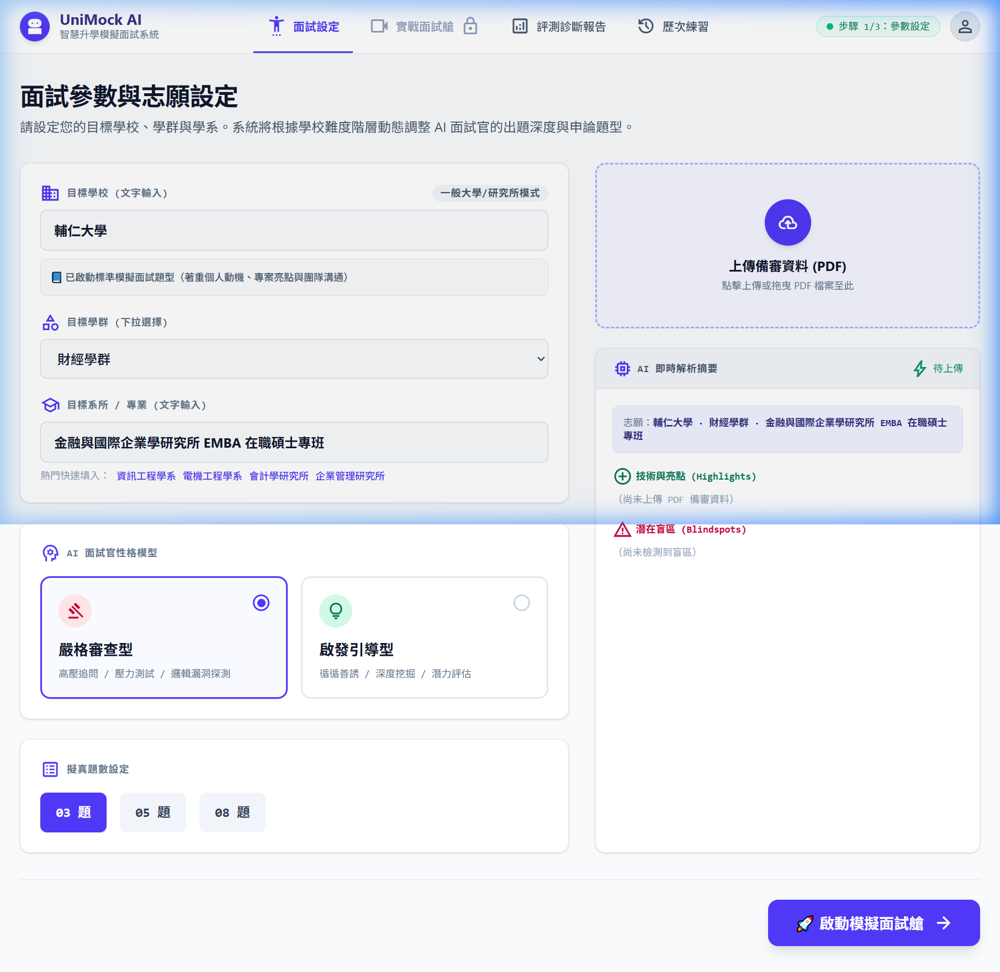
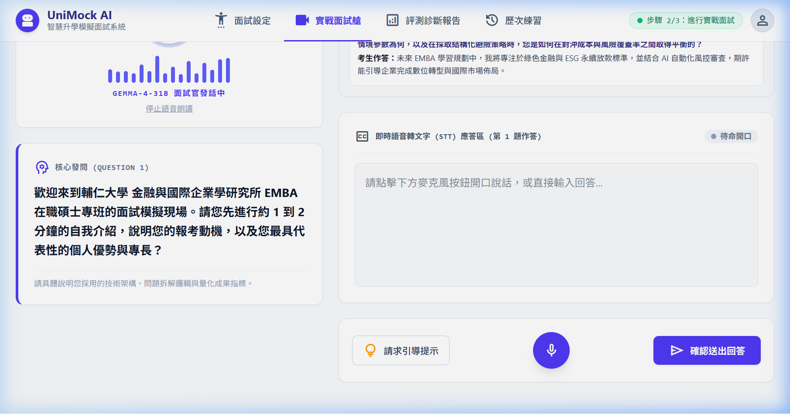

# 【Day 27】防呆與例外處理：網路中斷、麥克風異常與模型降級機制

真實使用環境充滿各種突發狀況，例如學生上傳了毀損的 PDF 備審資料、瀏覽器封鎖麥克風存取、或是 Google Cloud / LLM API 遇到 429 配額限制或網路中斷。今天我們要實作 **優雅降級（Graceful Degradation）** 與全套例外處理中介軟體，確保系統在任何極端異常下皆能保持穩定運行、絕不崩潰。

---

## 1. 例外情境處理矩陣 (Exception Handling Matrix)

| 異常情境 | 系統偵測機制 | 解決 / 優雅降級機制 |
| --- | --- | --- |
| **PDF 檔案損壞或解析失敗** | PyPDF2 / pdfplumber 解析 Exception | 前端跳出友情提示，自動降級切換為「純文字個人簡歷」備戰模式，不影響後續流程 |
| **麥克風權限被拒 / STT 裝置異常** | Web Speech API `onerror` 觸發 `not-allowed` | 即時關閉錄音波形動畫，跳出通知引導，自動無縫切換為「純文字打字回答」模式 |
| **LLM Gemma API 逾時 / 配額用盡 (429 Rate Limit)** | `gemma_llm.py` 捕捉 API 異常，觸發 3 次 Exponential Backoff 重試 | 重試失敗後啟動 `FallbackService` 降級引擎，自動派發領域專屬備用試題與結構化診斷報告 |

---

## 2. 後端降級處理器實作 (`app/services/fallback_service.py`)

我們打造了 `FallbackService`，針對商學（EMBA/MBA）、工學（資工/電機）與通用領域建立後備題庫與結構化報告生成器：

```python
# 核心降級派發邏輯 (FallbackService 核心切片)
class FallbackService:
    @classmethod
    def get_fallback_question(cls, target_major: str, turn_index: int = 1) -> str:
        is_business = any(kw in target_major for kw in ["EMBA", "MBA", "企管", "資管", "金融", "國企", "財金"])
        is_tech = any(kw in target_major for kw in ["資工", "資訊", "電機", "軟體", "數據", "AI"])
        category = "business" if is_business else ("tech" if is_tech else "general")
        questions = cls.DEFAULT_FALLBACK_QUESTIONS[category]
        return questions[(turn_index - 1) % len(questions)]

    @classmethod
    def get_fallback_evaluation_report(cls, target_school: str, target_major: str, transcript_turns: List[Dict[str, Any]]) -> Dict[str, Any]:
        logger.warning(f"Generating fallback evaluation report for {target_school} {target_major}")
        # 產出結構化 4 維度 82.0 分基礎報告與無標籤自然口語 STAR 高分示範...
        return { "overall_score": 82.0, "radar_scores": {...}, "question_diagnoses": [...] }
```

---

## 3. 前端容錯機制整合 (`SetupPage.jsx` & `InterviewPage.jsx`)

### 3.1 PDF 解析失敗降級至純文字模式 (`SetupPage.jsx`)

```javascript
  // PDF 檔案上傳例外捕捉與自動降級
  const handleFileUpload = async (e) => {
    const file = e.target.files?.[0];
    if (!file) return;
    setIsScanning(true);
    try {
      const profile = await uploadResumeApi(file, targetSchool, targetGroup, targetMajor);
      setUploadedFileName(profile.fileName);
      setSessionData((prev) => ({ ...prev, extractedProfile: profile }));
    } catch (err) {
      console.error('File upload failed:', err);
      alert('檔案解析失敗或格式損壞（請確認上傳有效的 PDF 備審資料）。系統已自動為您切換為純文字簡歷模式！');
    } finally {
      setIsScanning(false);
    }
  };
```

### 3.2 麥克風存取被拒自動切換打字模式 (`InterviewPage.jsx`)

```javascript
  // STT 麥克風權限被拒/裝置異常處理
  useEffect(() => {
    sttEngineRef.current = new SpeechToTextEngine(
      (text) => { if (text.trim()) setCandidateAnswer(text); },
      (err)  => {
        setIsRecording(false);
        if (err === 'not-allowed' || err === 'service-not-allowed' || err === 'audio-capture') {
          alert('麥克風存取權限被拒絕或裝置無回應。系統已自動為您切換為純文字打字模式！');
        }
      },
      ()     => { setIsRecording(false); }
    );
    return () => ttsEngine.stop();
  }, []);
```

---

## 4. 實機自動化測試與驗證 (Browser Subagent Demo)

我們透過 **Browser Subagent** 在實體瀏覽器上模擬異常觸發與系統降級回應：

### 4.1 PDF 損壞提示與純文字簡歷切換



### 4.2 麥克風權限被拒與打字模式切換



---

## 5. 單元測試與健全度驗證 (`tests/test_day27_fallback_service.py`)

我們編寫了單元測試，確保 `FallbackService` 在各種極端異常下均能正常產出降級內容：

```python
def test_fallback_question_generation_business():
    question = fallback_service.get_fallback_question("輔仁大學 EMBA 在職碩士專班", turn_index=1)
    assert "動機" in question or "成就" in question or "背景" in question

def test_fallback_evaluation_report_generation():
    report = fallback_service.get_fallback_evaluation_report("輔仁大學", "EMBA 專班", turns)
    assert report["overall_score"] >= 70.0
    assert "【Situation】" not in report["question_diagnoses"][0]["improved_sample"]
```

執行測試命令 `python -m pytest tests/test_day27_fallback_service.py` 順利通過驗證：
```text
============================== 3 passed in 0.15s ==============================
```

---

## 6. 本日總結與下一步預告

在 Day 27 中，我們完成了 UniMock AI 的完整防呆與優雅降級機制，包含：
1. **後端 Fallback 服務**：建立 `FallbackService`，於 LLM 超時或 429 限制時自動派發備用問題與評測報告。
2. **前端例外提示與容錯**：PDF 損壞自動降級純文字模式，麥克風權限被拒自動切換打字回答。
3. **全套單元測試 Pass**：驗證系統在零 API 網路連線狀態下仍能完美運行。

在下一階段（Day 28），我們將進行：
**【Day 28】全端效能調優：快取機制、快取預載與反應延遲優化**。

---

## 結語與明天預告

今天我們完善了系統的防呆與例外容錯機制，讓 UniMock AI 具備了高度健全的產品級穩定度。

明天 **【Day 28】**，我們將進行全端效能調優，將端到端響應延遲控制在 1.5 秒以內！
