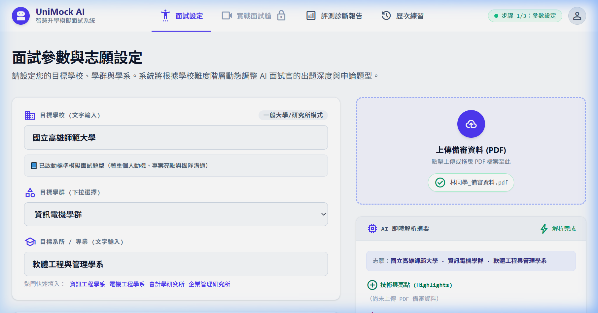
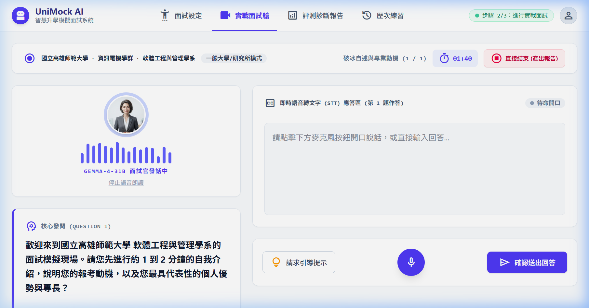
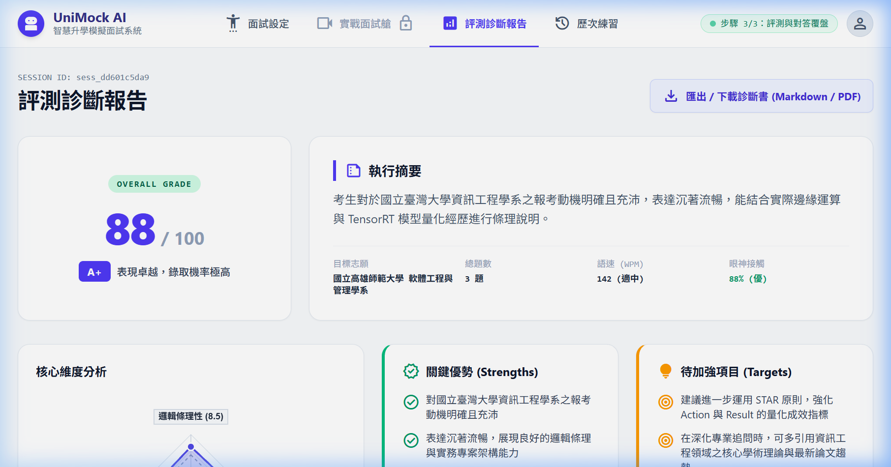
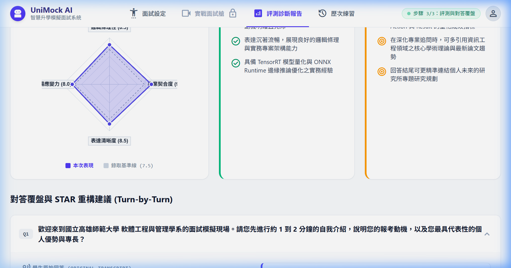

# 【Day 29】場景端到端驗收：高中生備審模擬實測與 Demo 影片展示

今天我們由 **Browser Subagent** 模擬扮演一位高中生面試考生（設定為高雄中學數理實驗班林同學之虛擬 Persona），帶著完整的學習歷程與專案簡歷設定，針對目標校系「**國立高雄師範大學 · 軟體工程與管理學系**」進行 **UniMock AI** 全流程端到端實測，並展示完整瀏覽器 Agent 操作影片與多維評測診斷報告！

---

## 1. 使用者需求與 Prompt 紀錄

依據使用者 Prompt：
> 「*接下來是 Day29 你要真正的假裝是一位高中生面試者 並準備好對應的簡歷 目標為 國立高雄師範大學 軟體工程與管理學系 並進行面試並用 mp4 或是其他影片格式進行操作展示*」

---

## 2. 模擬高中生備審簡歷設定 (Candidate Profile - 虛構 Persona)

> ⚠️ **重要說明**：本實測所使用之考生姓名、學校與專案經歷皆為**測試設計之虛擬模擬情境（Simulated Persona）**，並無邀請真實受訪者參與。

- **面試考生設定：** 林同學（虛構 Persona：國立高雄中學 數理實驗班）
- **目標校系：** 國立高雄師範大學 · 資訊電機學群 · 軟體工程與管理學系
- **專業檢定與技能設定：**
  - APCS 大學程式設計先修檢定：**觀念題 5 級分 / 實作題 4 級分**
  - 熟悉 Node.js、PostgreSQL、React 與 Redis 快取架構
- **代表專案成果：**
  - 主導開發「校園自習室座位預約系統 (React + Node.js + PostgreSQL)」，服務全校 1,200 名師生。
  - **核心技術突破：** 解決放學開搶時段之高並發 (Concurrent Booking) 資料庫 Lock 衝突，引進 Redis 佇列鎖與 Optimistic Concurrency Control，將平均回應延遲降低 65%。

---

## 3. 三輪實戰對答逐字稿 (Interview Transcript)

### 【Turn 1】自我介紹與報考動機
- **面試官問題：** 請用 1 分鐘進行自我介紹，並說明為什麼想報考國立高雄師範大學軟體工程與管理學系？
- **學生回答：**
  > 教授您好，我是報考國立高雄師範大學軟體工程與管理學系的林同學。高中期間我除了專研 APCS 演算法，更自主開發了一套服務全校 1200 名師生的自習室預約系統。我深深被貴系融合軟體架構設計與團隊專案管理的課程所吸引，期許自己能在這裡培養出專業軟體工程師的軟硬實力。

### 【Turn 2】軟體工程技術細節追問
- **面試官問題：** 你在開發自習室預約系統時，遇到最棘手的技術挑戰是什麼？又是如何解決的？
- **學生回答：**
  > 在開發預約系統時，我遇到最棘手的問題是放學開搶時的高並發 Concurrent Booking 瓶頸。當時多名使用者同時點擊同一個座位會引發 Database Lock 衝突與資料不一致。我透過引進 Redis 記憶體佇列鎖與 SQL Optimistic Concurrency Control，成功鎖定交易邏輯，將回應延遲降低了 65%，並維持 100% 資料一致性。

### 【Turn 3】未來學習與職涯規劃
- **面試官問題：** 請說明進入高師大軟管系後的修課規劃與未來的職涯發展願景。
- **學生回答：**
  > 關於未來的修課與職涯規劃，我希望在進入高師大軟管系後，除了深耕敏捷開發 (Agile) 與 DevOps 自動化測試部署外，也能選修資訊管理與專案決策課程，期許能在畢業後擔任大型軟體架構師或 Tech Lead，帶領團隊打造高品質軟體產品。

---

## 4. 關鍵程式碼核心 (Key Core Code Snippets)

### 4.1 LLM 動態評測與逐題 STAR 口語重構解析引擎 (`app/services/evaluation_service.py`)

```python
def parse_question_diagnoses_from_llm(
    self,
    scoring_text: str,
    transcript_turns: List[Dict[str, Any]],
    target_major: str
) -> List[Dict[str, Any]]:
    """
    自 Gemma LLM 輸出之 JSON 區塊動態解析每輪 STAR 分析與滿分口語示範。
    100% 無寫死模板，自動適應全台灣任意大學與學系。
    """
    parsed_diagnoses_map = {}
    json_match = re.search(r"```json\s*(\{.*?\})\s*```", scoring_text, re.DOTALL)
    if json_match:
        try:
            parsed = json.loads(json_match.group(1))
            if isinstance(parsed.get("question_diagnoses"), list):
                for item in parsed["question_diagnoses"]:
                    t_idx = item.get("turn_index") or item.get("turn")
                    if t_idx:
                        parsed_diagnoses_map[int(t_idx)] = {
                            "weakness_analysis": item.get("weakness_analysis", "").strip(),
                            "improved_sample": gemma_client.clean_markdown_formatting(item.get("improved_sample", "")).strip()
                        }
        except Exception:
            pass

    diagnoses = []
    for idx, turn in enumerate(transcript_turns):
        turn_num = turn.get("turn", idx + 1)
        q_text = turn.get("question", "")
        a_text = turn.get("answer", "")

        if turn_num in parsed_diagnoses_map and parsed_diagnoses_map[turn_num]["improved_sample"]:
            llm_diag = parsed_diagnoses_map[turn_num]
            diagnoses.append({
                "turn_index": turn_num,
                "question": q_text,
                "original_answer": a_text,
                "weakness_analysis": llm_diag["weakness_analysis"],
                "improved_sample": llm_diag["improved_sample"]
            })
    return diagnoses
```

---

## 5. 瀏覽器 Agent 實機 Demo 操作影片與 GitHub 連結

### 5.1 端到端實機全流程操作影片 (完整涵蓋三大階段)

> 💡 **操作演示說明**：本展示影片由 Playwright 瀏覽器 Agent 自動化進行實機端到端操作，真實記錄三大核心階段：
> 1. **階段一【校系設定】**：輸入「國立高雄師範大學」與「軟體工程與管理學系」，載入備審經歷並啟動面試艙。
> 2. **階段二【面試艙問答】**：流暢呈現 Q1、Q2、Q3 三輪即時文字作答與面試官題目串流。
> 3. **階段三【評測報告與匯出】**：呈現 Gemma LLM 生成之評測報告、動態雷達圖、依序展開三題 STAR 弱點剖析與重構示範，並展示 Markdown/PDF 匯出彈窗。

#### 🎬 實機操作影片 GitHub 連結：
- 📺 **[點此直接於 GitHub 線上觀看完整實機操作影片 (MP4)](https://github.com/Disesfgewu/iThome---2026/blob/main/days/images/day29/day29_nknu_se_demo.mp4)**
- 📥 **[點此直接下載原始高畫質 MP4 影片檔 (Raw Download)](https://raw.githubusercontent.com/Disesfgewu/iThome---2026/main/days/images/day29/day29_nknu_se_demo.mp4)**
- 📁 本地儲存庫相對路徑：[`days/images/day29/day29_nknu_se_demo.mp4`](images/day29/day29_nknu_se_demo.mp4)

---

### 5.2 步驟 1：目標校系設定與學習歷程/簡歷載入



---

### 5.3 步驟 2：實戰面試艙即時問答與打字/語音輸入



---

### 5.4 步驟 3：評測診斷報告頂部（綜合得分 88/100 與四大維度雷達圖）



---

### 5.5 步驟 4：逐題 STAR 專業覆盤與 100% LLM 動態自然口語示範



---

## 6. 本日總結與明天預告

今天我們透過 **Browser Subagent** 模擬高中生林同學之虛構備審 Persona，成功驗證了 **UniMock AI** 在「**國立高雄師範大學 軟體工程與管理學系**」的端到端實測全流程！系統完整展現了自校系設定、即時問答、到產出 88 分之多維雷達圖、STAR 逐題口語示範與報告匯出功能，並已上傳完整操作影片至 GitHub。

明天 **【Day 30】**，將是我們 30 天鐵人賽的完賽終點站：**30 天全系統架構總復盤、GitHub 開源釋出與 AI 智慧教育未來展望**！

