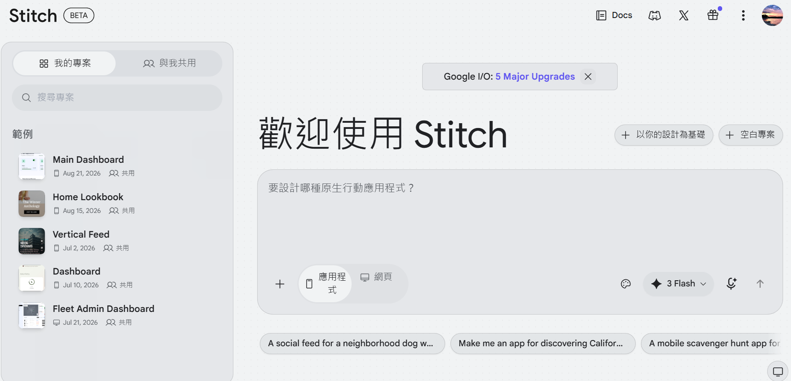
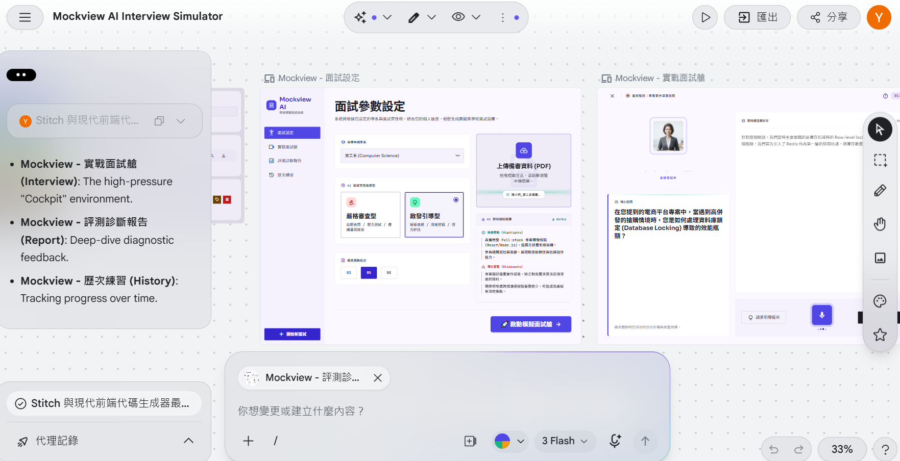

# 【Day 3】AI 賦能前端：使用 Google Stitch 快速生成模擬面試艙原型

在打通了後端模型的 API 串接後，今天我們要著手打造 **UniMock AI** 的第一個前端介面。為了大幅提升開發效率，我們選用 **Google Stitch** 來快速生成高保真（High-Fidelity）的模擬面試座艙 UI 原型。

---

## 1. 為什麼選擇 Google Stitch 進行 UI 原型設計？

在現代 AI 全端開發流程中，「先視覺化 UI，再逆向設計 API」能讓我們在早期精確定位使用者需求：
- **快速疊代：** 透過 Prompt 直播生成現代化現代 UI 元件。
- **元件語意化：** 產出的 HTML/CSS 具備良好的結構與響應式佈局。
- **沉浸感視覺：** 直接內建 Dark Mode、玻璃擬態（Glassmorphism）與音波動畫樣式。

[google stitch](https://stitch.withgoogle.com/?pli=1)


---

## 2. 模擬面試艙 Stitch Prompt 設計

我們輸入給 Google Stitch 的核心 Prompt 設計草稿如下：

```markdown
Generate a complete, executable React single-page frontend application named "Mockview" that strictly fulfills the following technical, state, UI, and design specifications. 

### 1. Architectural & File Tree Constraints
Strictly match this modular architecture in pure React 18 (using Tailwind CSS classes or inline style tokens):
- `src/tokens.jsx`: Color variables, typography tokens, global CSS transitions.
- `src/ui.jsx`: Reusable atoms (Button, Badge, Card, Stepper, Modal, WaveformBar, RadarCanvas).
- `src/shell.jsx`: Top navigation header, active route switcher, status badges.
- `src/pages/setup.jsx`: Step 1 - Target major selection, persona picker, PDF drag-and-drop parse simulation.
- `src/pages/interview.jsx`: Step 2 - Audio cockpit, real-time STT streaming simulator, live timers, dynamic follow-up bubble.
- `src/pages/report.jsx`: Step 3 - Radar chart visualizer, Rubric scorecard (STAR), question-by-question rewrite comparison table.
- `src/pages/history.jsx`: Step 4 - Recent interview sessions table and report reload handler.
- `src/app.jsx`: Root State Manager holding global active session, step state machine, and mock data repository.
*Constraint*: Remove all Authentication (Login/Register/Auth tokens) and Admin management portals completely.

---

### 2. Global State & Data Models (JavaScript Mock Objects)
Embed these exact state schemas and rich mock defaults inside `src/app.jsx`:

// Global Active Session State Definition
const mockInitialSession = {
  sessionId: "sess_20260824_cs01",
  targetMajor: "國立成功大學 資訊工程學系",
  interviewerPersona: "strict", // "strict" | "socratic"
  totalQuestions: 3,
  currentQuestionIndex: 1, // 0-based
  isRecording: false,
  extractedProfile: {
    fileName: "陳小明_資工自傳與專案.pdf",
    highlights: [
      { category: "專案實作", title: "Edge AI 智慧排程系統", desc: "使用 FastAPI 與輕量化模型優化產線瓶頸" },
      { category: "競賽得獎", title: "全國大專軟體創作競賽", desc: "榮獲大專組佳作，負責 Agent 狀態流轉設計" }
    ],
    detectedBlindspots: [
      "自傳提及模型延遲降低 50%，但未列出具體 Benchmark 基準與硬體環境",
      "高中自主學習計畫中，API 安全認證機制描述略顯簡略"
    ]
  },
  dialogueHistory: [
    {
      turn: 1,
      phase: "破冰自述與動機",
      interviewerQuestion: "請用兩分鐘時間簡述：你過去在 Edge AI 專案中遇到最大的工程瓶頸是什麼？你如何驗證你的解法有效？",
      candidateTranscript: "我在專案中發現模型部署在邊緣端時記憶體不足，後來我把模型做了一些量化，然後跑起來就變順了。",
      rubricScore: { logic: 6, techFit: 7, clarity: 6, adaptability: 7 },
      weaknessAnalysis: "回答過於籠統，缺乏量化數據與具體的技術選型對比（如使用了幾位元量化、推論延遲降低多少毫秒）。",
      improvedSample: "在 Jetson 邊緣端部署時，主要瓶頸在於推論時 VRAM 溢出（OOM）。我透過 TurboQuant 與 INT8 量化技術，將權重記憶體佔用從 4.2GB 壓縮至 1.8GB，在維持 94% 準確率的前提下，推論 FPS 從 12 提升至 38。"
    }
  ],
  evaluationReport: {
    compositeScore: 84,
    grade: "A- (優良 / 具備良好基礎)",
    rubricMatrix: {
      logicStructure: 8.2,      // STAR 原則
      domainKnowledge: 8.8,     // 專業契合度
      communicationClarity: 7.5,// 表達清晰度
      adaptability: 8.0         // 臨場應變
    },
    keyStrengths: [
      "專案實作經驗豐富，具備實際動手調校模型的能力",
      "對於學系欲發展的研究領域（Edge Computing & LLM）理解明確"
    ],
    keyImprovements: [
      "回答時應多使用 STAR 架構（情境-任務-行動-成果）收尾",
      "面臨壓力追問時，語速有加快趨勢，建議適度停頓組織架構"
    ]
  }
};

---

### 3. Component Details & Interactive Behavior

#### A. Global Navigation (`src/shell.jsx`)

* Top Fixed Bar: Height `64px`, background `#ffffff`, border-bottom `1px solid #e2e8f0`.
* Left: Brand icon (AI glowing badge) + "Mockview · AI 大學模擬面試".
* Center: 4 interactive tabs with badge counters:
`[1. 面試設定]` ➔ `[2. 實戰面試艙]` ➔ `[3. 評測診斷報告]` ➔ `[4. 歷次練習]`
* Right: System Status pill ("面試中 - 第 2/3 題" in Emerald pulse) + Audio Hardware indicator.

#### B. Setup Screen (`src/pages/setup.jsx`)

* Left Grid (60%):
* College Major Dropdown with pre-filled groups: (資工系、醫學系、電機系、企管系).
* Persona Selector Radio Cards:
1. **嚴格審查型 (Strict)**: 深挖架構盲點、壓力測試、邏輯檢驗。
2. **啟發引導型 (Socratic)**: 引導探索學習動機、重視思維歷程與反思潛力。


* Question count selector pills: `3 題 (快速體驗)` | `5 題 (完整模擬)` | `8 題 (高壓甄試)`.


* Right Grid (40%):
* Animated Drag-and-Drop Area. Dropping a file triggers a 2-second simulated scanning bar (`mvScan` animation), instantly rendering the extracted `highlights` tags and `detectedBlindspots` warning box.


* Bottom Action: Full-width button: `🚀 啟動模擬面試艙 (Start Interview)` -> switches app state to `interview`.

#### C. Interview Cockpit (`src/pages/interview.jsx`)

* Top Status: Stepper progress ("當前階段：專案實作深度追問") + Timer countdown component (`01:45` in font `JetBrains Mono`).
* Left Video/Avatar Box:
* Simulated AI Professor persona frame with border glow.
* Active Voice Visualizer: 16 dynamic bouncing vertical bars (`mvWaveform` keyframe) rendering when professor is speaking.
* Live Question Display: Streaming typewriter effect rendering the `interviewerQuestion`.


* Right Console Area:
* Real-time STT transcription card: Text box updating in real-time with blinking cursor (`mvBlink`).
* Audio Control Dock: Big round pulsating mic button (`#4f46e5`, `mvPulse`), audio input level meter, and manual text fallback expander.


* Action Buttons:
* `請求引導提示 (Hint)`: Pops up a light modal showing a Socratic reasoning clue.
* `確認送出回答 (Submit)`: Appends answer to history, increments `currentQuestionIndex`. If final question, transitions view state to `report`.


#### D. Diagnostic Report (`src/pages/report.jsx`)

* Top Scorecard: Composite score `84 / 100` badge + Grade ribbon + Executive summary text.
* Mid Section (2-Column):
* Left: HTML5 Canvas or SVG Radar Chart drawing the 4 dimensions from `rubricMatrix` with polygon fill (`rgba(79, 70, 229, 0.2)`).
* Right: Key Strengths (Green checkmarks) & Improvement Targets (Orange alert tags).


* Bottom Section: Turn-by-Turn Accordion Cards:
* Displays: Question ➔ Student's Original Answer ➔ AI Weakness Analysis ➔ **Optimized STAR Sample Comparison Table** (Comparing Original vs. Enhanced version).


* Footer Actions: `下載 PDF 診斷書`, `重新挑戰一輪 (Reset to Setup)`.

---

### 4. Styling & Animations Implementation

* Implement exact CSS keyframes inside `src/tokens.jsx` for `@keyframes mvWaveform`, `@keyframes mvPulse`, `@keyframes mvBlink`, and `@keyframes mvScan`.
* Use slate `#0c0c14` for typography, `#fafafa` for workspace background, `#4f46e5` for primary actions, `#10b981` for scores/success, and `#f59e0b` for warnings.
* Deliver cleanly split JSX files ready to mount directly onto `<div id="root"></div>`.


---

## 3. 生成成果與介面區域剖析

Stitch 產出的 HTML 原型包含了四大核心元件區域：

+-----------------------------------------------------------------------+
|  [UniMock AI Logo]   目標學系：資工系   面試時間：12:45   [結束面試]  |
+-----------------------------------------------------------------------+
|                                  |                                    |
|   [ 🤖 AI 面試官視訊與發問區 ]    |    [ 👤 學生即時回答與鏡頭區 ]     |
|   - 擬真教授 Persona             |    - 即時 Webcam Preview          |
|   - 動態音波 (Waveform Bars)     |    - 語音 STT 逐字稿顯示          |
|   - 題目說明與專案追問文字       |    - 文字補充輸入框               |
|                                  |                                    |
+-----------------------------------------------------------------------+
|                      進度條：[████████░░░░░░] 2 / 5 題               |
+-----------------------------------------------------------------------+

---

## 4. 前端原型 Code Draft (`frontend/index.html`)

<!DOCTYPE html>
<html lang="zh-TW" class="dark">
<head>
  <meta charset="UTF-8">
  <title>UniMock AI - 沉浸式模擬面試艙</title>
  <script src="https://cdn.tailwindcss.com"></script>
</head>
<body class="bg-slate-950 text-slate-100 min-h-screen flex flex-col font-sans">
  <!-- 頂部列 -->
  <header class="h-16 border-b border-slate-800 px-6 flex items-center justify-between bg-slate-900/50 backdrop-blur">
    <div class="flex items-center gap-3">
      <div class="h-3 w-3 rounded-full bg-cyan-400 animate-pulse"></div>
      <h1 class="font-bold text-xl tracking-wider text-cyan-400">UniMock AI</h1>
      <span class="text-xs px-2.5 py-1 rounded-full bg-slate-800 text-slate-300">目標：資訊工程學系</span>
    </div>
    <div class="text-sm font-mono text-slate-400">剩餘時間：14:32</div>
  </header>

  <!-- 主對話區域 -->
  <main class="flex-1 grid grid-cols-1 md:grid-cols-2 gap-6 p-6">
    <!-- AI 面試官窗格 -->
    <div class="rounded-2xl bg-slate-900/60 border border-slate-800 p-6 flex flex-col justify-between">
      <div>
        <h2 class="text-sm text-cyan-400 font-semibold mb-2">面試官發問 (Gemma-4-31B Engine)</h2>
        <p class="text-lg leading-relaxed">「請說明你在高中專案中，使用 OpenCV 進行人臉辨識時遇到了什麼效能瓶頸？你是如何解決的？」</p>
      </div>
      <div class="flex items-center gap-1 h-8 mt-4">
        <div class="w-1 bg-cyan-500 h-4 animate-bounce"></div>
        <div class="w-1 bg-cyan-400 h-8 animate-bounce delay-100"></div>
        <div class="w-1 bg-cyan-500 h-6 animate-bounce delay-200"></div>
      </div>
    </div>

    <!-- 學生應答窗格 -->
    <div class="rounded-2xl bg-slate-900/60 border border-slate-800 p-6 flex flex-col justify-between">
      <div>
        <h2 class="text-sm text-purple-400 font-semibold mb-2">學生回答 (語音逐字稿)</h2>
        <textarea class="w-full bg-slate-950/80 border border-slate-800 rounded-xl p-4 text-slate-200 focus:outline-none focus:border-cyan-500 transition h-36" placeholder="請回答或點擊下方麥克風開口說話..."></textarea>
      </div>
      <div class="flex justify-end gap-3 mt-4">
        <button class="px-6 py-2.5 rounded-xl bg-cyan-500 hover:bg-cyan-400 text-slate-950 font-bold transition">送出回答</button>
      </div>
    </div>
  </main>
</body>
</html>
```


---

## 得到設計


---
## 結語與明天預告

今天我們透過 Google Stitch 產出了現代化黑夜風格的面試艙 UI 原型。

明天 **【Day 4】**，我們將精細打磨這個 Stitch 前端畫面，並補齊面試待機、進行中與評分生成的狀態切換！
