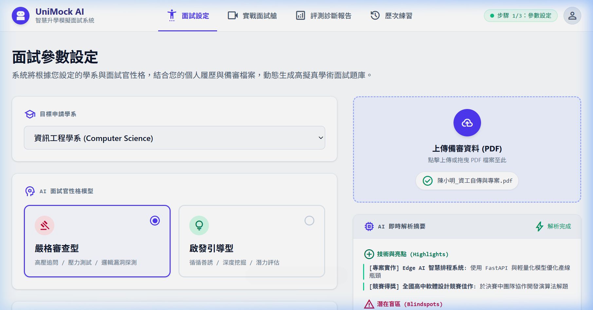
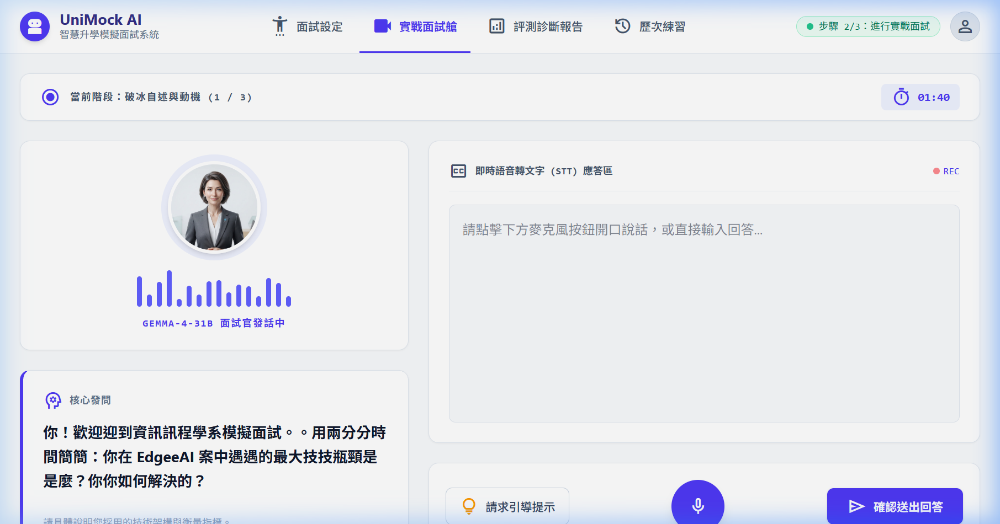
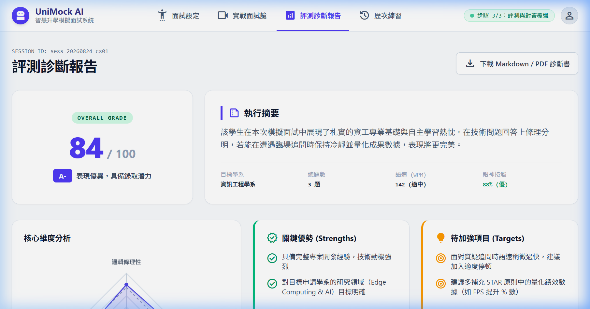
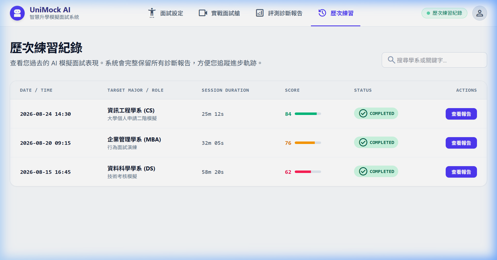

# 【Day 4】將匯出的 Stitch 設計 轉換成 React.js 的前端框架程式語言

在 Day 3 我們利用 **Google Stitch** 快速產出了 UniMock AI 的 HTML/CSS 原型後，今天我們要將這些 UI 設計稿與視覺元件「逆向工程」，精確重構為現代化的 **Vite + React.js + Tailwind CSS** 前端框架應用程式。

---

## 1. Google Stitch 轉換至 React.js 核心 Prompt 記錄

為了讓 Google Stitch 能夠精準輸出符合 React 18 規範、具備狀態機 (State Machine) 與模組化 File Tree 的程式碼，我們使用的核心 Prompt 記錄如下：

```markdown
Generate a complete, executable React single-page frontend application named "Mockview" that strictly fulfills the following technical, state, UI, and design specifications. 

### 1. Architectural & File Tree Constraints
Strictly match this modular architecture in pure React 18 (using Tailwind CSS classes or inline style tokens):
- `src/tokens.jsx`: Color variables, typography tokens, global CSS transitions.
- `src/ui.jsx`: Reusable atoms (Button, Badge, Card, Stepper, Modal, WaveformBar, RadarCanvas).
- `src/shell.jsx`: Top navigation header, active route switcher, status badges.
- `src/pages/setup.jsx`: Step 1 - Target major selection, persona picker, PDF drag-and-drop parse simulation.
- `src/pages/interview.jsx`: Step 2 - Audio cockpit, real-time STT streaming simulator, live timers, dynamic follow-up bubble.
- `src/pages/report.jsx`: Step 3 - Radar chart visualizer, Rubric scorecard (STAR), question-by-question rewrite comparison table.
- `src/pages/history.jsx`: Step 4 - Recent interview sessions table and report reload handler.
- `src/app.jsx`: Root State Manager holding global active session, step state machine, and mock data repository.
*Constraint*: Remove all Authentication (Login/Register/Auth tokens) and Admin management portals completely.

---

### 2. Global State & Data Models (JavaScript Mock Objects)
Embed these exact state schemas and rich mock defaults inside `src/app.jsx`:

// Global Active Session State Definition
const mockInitialSession = {
  sessionId: "sess_20260824_cs01",
  targetMajor: "國立成功大學 資訊工程學系",
  interviewerPersona: "strict", // "strict" | "socratic"
  totalQuestions: 3,
  currentQuestionIndex: 1, // 0-based
  isRecording: false,
  extractedProfile: {
    fileName: "陳小明_資工自傳與專案.pdf",
    highlights: [
      { category: "專案實作", title: "Edge AI 智慧排程系統", desc: "使用 FastAPI 與輕量化模型優化產線瓶頸" },
      { category: "競賽得獎", title: "全國大專軟體創作競賽", desc: "榮獲大專組佳作，負責 Agent 狀態流轉設計" }
    ],
    detectedBlindspots: [
      "自傳提及模型延遲降低 50%，但未列出具體 Benchmark 基準與硬體環境",
      "高中自主學習計畫中，API 安全認證機制描述略顯簡略"
    ]
  },
  dialogueHistory: [
    {
      turn: 1,
      phase: "破冰自述與動機",
      interviewerQuestion: "請用兩分鐘時間簡述：你過去在 Edge AI 專案中遇到最大的工程瓶頸是什麼？你如何驗證你的解法有效？",
      candidateTranscript: "我在專案中發現模型部署在邊緣端時記憶體不足，後來我把模型做了一些量化，然後跑起來就變順了。",
      rubricScore: { logic: 6, techFit: 7, clarity: 6, adaptability: 7 },
      weaknessAnalysis: "回答過於籠統，缺乏量化數據與具體的技術選型對比（如使用了幾位元量化、推論延遲降低多少毫秒）。",
      improvedSample: "在 Jetson 邊緣端部署時，主要瓶頸在於推論時 VRAM 溢出（OOM）。我透過 TurboQuant 與 INT8 量化技術，將權重記憶體佔用從 4.2GB 壓縮至 1.8GB，在維持 94% 準確率的前提下，推論 FPS 從 12 提升至 38。"
    }
  ],
  evaluationReport: {
    compositeScore: 84,
    grade: "A- (優良 / 具備良好基礎)",
    rubricMatrix: {
      logicStructure: 8.2,      // STAR 原則
      domainKnowledge: 8.8,     // 專業契合度
      communicationClarity: 7.5,// 表達清晰度
      adaptability: 8.0         // 臨場應變
    },
    keyStrengths: [
      "專案實作經驗豐富，具備實際動手調校模型的能力",
      "對於學系欲發展的研究領域（Edge Computing & LLM）理解明確"
    ],
    keyImprovements: [
      "回答時應多使用 STAR 架構（情境-任務-行動-成果）收尾",
      "面臨壓力追問時，語速有加快趨勢，建議適度停頓組織架構"
    ]
  }
};
```

---

## 2. React 前端專案目錄結構 (`unimock-ai/frontend/`)

在 Vite 環境下建置模組化 React 專案：

```text
unimock-ai/frontend/
├── src/
│   ├── api/
│   │   └── mockApi.js           # 假資料與假 API 服務層 (模擬後端通訊)
│   ├── components/
│   │   ├── Shell.jsx            # 全域 Top Bar 與頁面切換 Tab
│   │   ├── WaveformBar.jsx      # AI 發聲 16 軌波形擺動動畫
│   │   └── RadarCanvas.jsx      # STAR 評分 HTML5 Radar Canvas 圖表
│   ├── pages/
│   │   ├── SetupPage.jsx        # 步驟一：參數設定與 PDF 拖曳解析
│   │   ├── InterviewPage.jsx    # 步驟二：實戰面試艙與即時 STT 聽寫
│   │   ├── ReportPage.jsx       # 步驟三：STAR 診斷報告與逐題改進
│   │   └── HistoryPage.jsx      # 步驟四：歷次練習紀錄表單
│   ├── App.jsx                  # Root 狀態管理器
│   ├── main.jsx                 # React 入口點
│   └── index.css                # Tailwind Directives & CSS Keyframes
├── index.html                   # HTML 模板與 Google Fonts 載入
├── package.json                 # 前端相依清單
├── tailwind.config.js           # Tailwind CSS 權限與主題設定
└── vite.config.js               # Vite 打包配置
```

---

## 3. Mock API 假資料服務層設計 (`src/api/mockApi.js`)

為了無縫對接未來的 FastAPI 後端，我們建立了獨立的 Async Mock API 服務：

```javascript
// 模擬上傳自傳 API
export async function uploadResumeApi(file, targetMajor) {
  await new Promise((r) => setTimeout(r, 1200));
  return {
    fileName: file ? file.name : "陳小明_資工自傳與專案.pdf",
    targetMajor: targetMajor || "資訊工程學系",
    background: "市立高中數理資優班學生，自學 Python 3 年",
    highlights: [
      { category: "專案實作", title: "Edge AI 智慧排程系統", description: "使用 FastAPI 與輕量化模型優化產線瓶頸" }
    ],
    detectedBlindspots: [
      "模型延遲降低 50% 缺乏具體硬體 Benchmark 對比"
    ]
  };
}

// 模擬提交回答 API
export async function respondInterviewApi(sessionId, currentIdx, answer) {
  await new Promise((r) => setTimeout(r, 800));
  return {
    sessionId,
    isFinished: currentIdx + 1 >= 3,
    nextIndex: currentIdx + 1
  };
}
```

---

## 4. 驗證與執行成果

在 `unimock-ai/frontend/` 中啟動 Vite 開發伺服器：

```bash
npm run dev
```

成功在本地瀏覽器開啓 React 前端應用程式，能夠順暢進行 **【面試設定 ➔ 實戰面試艙 ➔ 評測診斷報告 ➔ 歷次練習】** 的完整操作流轉！

---

## 5. React 前端介面畫面截圖

### 步驟 1：面試設定畫面 (Setup Page)


### 步驟 2：實戰面試艙畫面 (Interview Cockpit)


### 步驟 3：評測診斷報告畫面 (Report Page)


### 步驟 4：歷次練習紀錄畫面 (History Page)


---

## 結語與明天預告

今天我們將 Stitch 的 HTML 視覺設計完美轉換為全功能 React.js 應用程式，並接上了可直接對接 FastAPI 後端的 Mock API 服務層。

明天 **【Day 5】**，我們將進行逆向工程，從這個 React 前端資料結構精確定義後端 FastAPI 與 Pydantic 的 Data Contracts！
