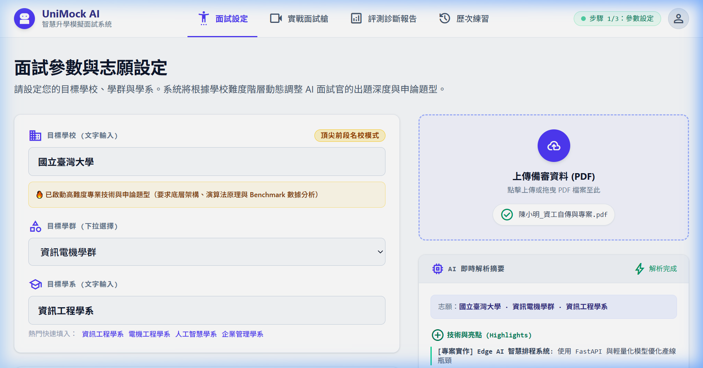
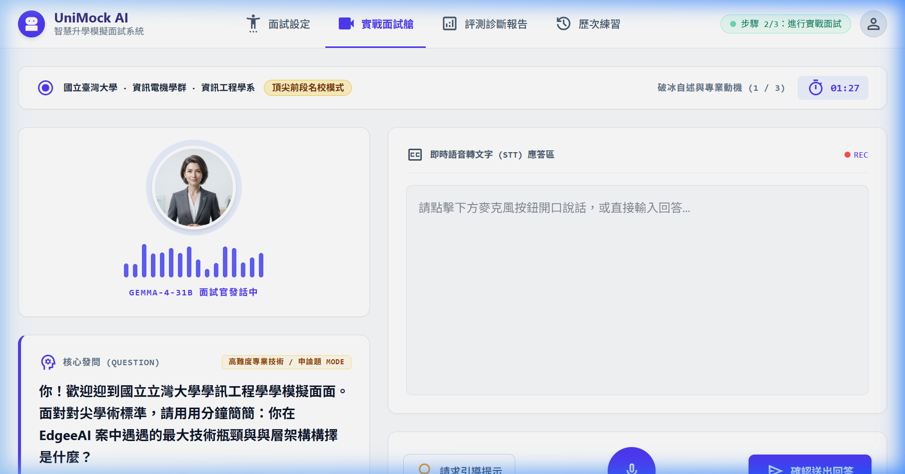
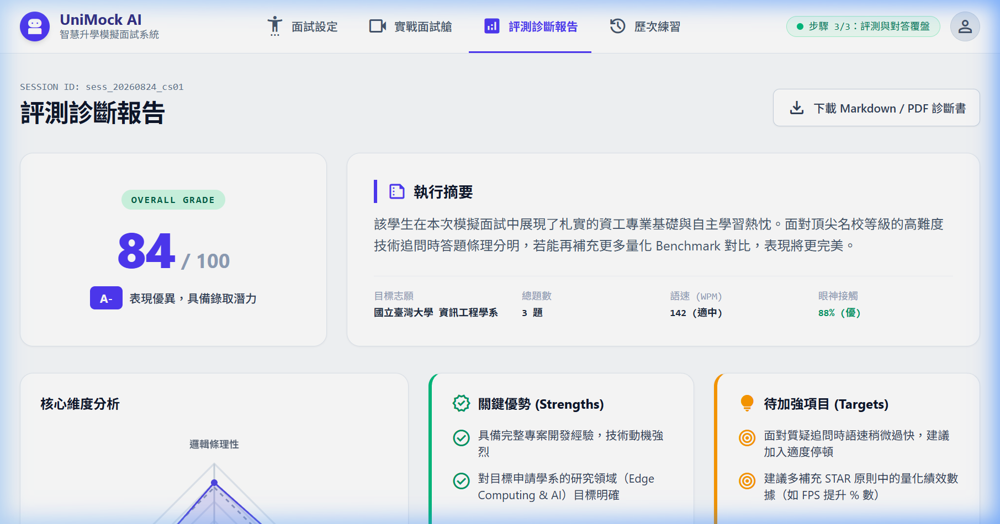

# 【Day 5】介面打磨：調整 UI 畫面與互動元件體驗優化

在 Day 4 我們將 Google Stitch 的設計稿成功轉譯為 React.js 前端架構後，今天我們要深入進行 **UI 畫面打磨與微互動元件體驗優化 (Micro-interactions & UI Polish)**，讓整體模擬面試艙的視覺質感與操作體驗更具專業沉浸感。

---

## 1. 介面打磨與體驗優化四大重點

為了給使用者帶來流暢且具備沉浸感的模擬面試體驗，我們在 React 前端進行了以下四大維度的細節打磨：

1. **視覺層次與 Color Design System：**
   - 採用 Indigo (`#4f46e5`) 作為核心品牌主色，搭配 Emerald (`#10b981`) 成功狀態與 Rose (`#f43f5e`) 盲點警告色。
   - 為各卡片容器增加微陰影 (`shadow-sm` / `shadow-xs`) 與圓角 (`rounded-xl` / `rounded-2xl`)，提升畫面精緻度。

2. **動態波形與聲音視覺反饋 (`WaveformBar.jsx`)：**
   - 打造 16 軌獨立彈跳波形條，當 AI 面試官發聲時呈現動態波動效果，讓 AI 教授角色更具互動生命力。

3. **即時聽寫與打字機流暢動畫：**
   - 核心問題區整合打字機（Typewriter）流式漸進呈現。
   - 學生應答區整合脈動閃爍游標 (`animate-mvBlink`) 與動態脈衝麥克風按鈕 (`animate-mvPulse`)。

4. **響應式佈局 (Responsive Layout & Mobile Support)：**
   - 頂部導覽列 `Shell.jsx` 在行動裝置下自動收合為流暢 Icon 佈局，維持高可用性。

---

## 2. 關鍵元件打磨程式碼展示

### A. 動態音波動畫元件 (`src/components/WaveformBar.jsx`)

```jsx
import React, { useEffect, useState } from 'react';

export default function WaveformBar({ isSpeaking = true }) {
  const [heights, setHeights] = useState([40, 75, 55, 90, 60, 80, 45, 95, 70, 50, 85, 65, 90, 40, 70, 50]);

  useEffect(() => {
    if (!isSpeaking) return;
    const interval = setInterval(() => {
      setHeights(
        Array.from({ length: 16 }, () => Math.floor(Math.random() * 75) + 20)
      );
    }, 150);
    return () => clearInterval(interval);
  }, [isSpeaking]);

  return (
    <div class="flex items-end gap-1.5 h-12 w-48 justify-center">
      {heights.map((h, idx) => (
        <div
          key={idx}
          style={{ height: isSpeaking ? `${h}%` : '15%' }}
          class="w-1.5 bg-indigo-500 rounded-full transition-all duration-150"
        />
      ))}
    </div>
  );
}
```

### B. 麥克風脈衝與微互動元件樣式 (`src/index.css`)

```css
/* 麥克風錄音動態脈衝效果 */
@keyframes mvPulse {
  0% {
    box-shadow: 0 0 0 0 rgba(79, 70, 229, 0.4);
  }
  70% {
    box-shadow: 0 0 0 16px rgba(79, 70, 229, 0);
  }
  100% {
    box-shadow: 0 0 0 0 rgba(79, 70, 229, 0);
  }
}

.animate-mvPulse {
  animation: mvPulse 2s infinite cubic-bezier(0.66, 0, 0, 1);
}

/* 備審檔案拖曳區掃描條動畫 */
@keyframes scanVertical {
  0% { top: 0; opacity: 0; }
  10% { opacity: 1; }
  90% { opacity: 1; }
  100% { top: 100%; opacity: 0; }
}

.mvScan {
  position: absolute;
  left: 0;
  width: 100%;
  height: 2px;
  background: linear-gradient(to right, transparent, #10b981, transparent);
  box-shadow: 0 0 12px 2px rgba(16, 185, 129, 0.5);
  animation: scanVertical 2.5s infinite cubic-bezier(0.4, 0, 0.2, 1);
  z-index: 10;
}
```

---

## 3. 面試參數輸入優化與學校難度分級邏輯

### A. 給 Antigravity AI 的修改 Prompt 紀錄

在與 **Google Antigravity AI** 對話溝通時，我們提出了以下關鍵 Prompt 進行 UI 參數與出題難度重構：

```markdown
> "幫我修改：
> 1. 目標學系要可以被輸入。
> 2. 選單設定要可以包含「學群」與「學校」，其中『學群』使用下拉選單，『學校』使用文字輸入。
> 3. 越高等、越前面的頂尖名校（如台大、成大、清大、交大等），後端 AI 設計時要給予比較困難的『技術專業型問題』與『長篇申論型大題』。"
```

### B. 修改改動細節與組件變更日誌 (Modification Log)

1. **`src/pages/SetupPage.jsx`：**  
   - 將固定學系選單拆解為 **學校 (Text Input)** + **學群 (Dropdown Select)** + **學系 (Text Input)** 組合。
   - 新增頂尖名校難度動態監聽：當輸入頂尖學校時，即時渲染 `🔥 頂尖前段名校模式` Amber 提醒看板。
2. **`src/api/mockApi.js`：**  
   - 新增 `mockDepartmentGroups`（包含資訊電機學群、醫藥衛生學群、工程學群等 10 大學群）。
   - 實作 `checkSchoolTier(schoolName)` 函式，自動過濾頂尖前段大學關鍵字並開啓難度加成。
3. **`src/pages/InterviewPage.jsx` & `ReportPage.jsx` & `HistoryPage.jsx`：**  
   - 頂部資訊列與診斷書同步擴充呈現 `目標學校 · 目標學群 · 目標學系` 完整履歷標籤。

---

## 4. 修改後介面畫面與成效截圖 (Screenshots & Results)

經由 Antigravity 自動化重構與測試，成果截圖如下：

### 步驟 1：面試設定畫面 (含學校文字輸入與名校難度 Banner)


### 步驟 2：實戰面試艙畫面 (含學校學群學系與高難度發問 Mode)


### 步驟 3：評測診斷報告畫面 (完整呈現學校與學系診斷書)


---

## 結語與明天預告

今天我們完成全套 UI 畫面打磨與微互動元件體驗優化，第一階段「專案啟航與 UI 原型」完美收官！

明天 **【Day 6】**，我們將邁入第二階段：**開始建置面試題庫清理與向量 Embedding 資料庫**！
