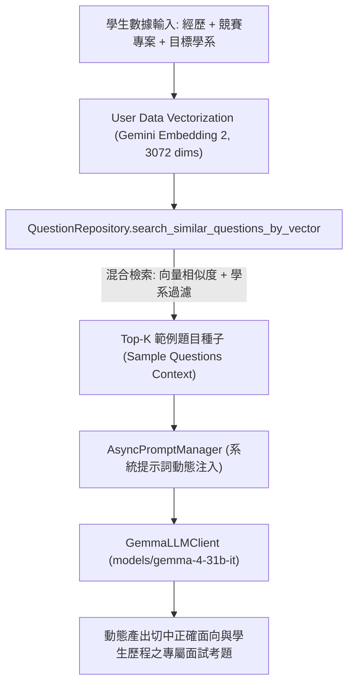

# 【Day 8】知識檢索：User 資料 Embedding 向量化、RAG 相似度比對與 Gemma-4-31B 出題引擎

在建立了 Day 7 的 Gemma-4-31B Chat Client、非同步 System Prompt 管理器與資安 Guardrail 之後，今天我們完成第二階段的關鍵樞紐——**User 資料向量化 (User Profile Embedding)、RAG 相似度比對與動態題目生成引擎 (RAGRetrieverService)**。

本系統的文本生成 LLM **嚴格且唯一採用專屬開源旗艦模型 `models/gemma-4-31b-it`**。系統透過將學生的「個人經歷、競賽專案與目標學系」進行 **Gemini Embedding 2 3,072 維度向量化**，下探至擁有 2,045 筆 pre-embedded 向量資料庫進行餘弦相似度 (Cosine Similarity) 檢索，抽取出最適切的「範例題目種子 (Sample Questions Seed Context)」，交由 Gemma-4-31B-it 模型實時動態合成全新且專屬的面試考題。

---

## 1. RAG 雙層向量與過濾檢索架構設計 (RAG Architecture)



---

## 2. 核心服務實作：RAG 檢索器與向量比對引擎 (`app/services/rag_service.py`)

```python
import asyncio
from typing import List, Dict, Any, Optional
from app.services.embedding_service import embedding_service
from app.repositories.question_repository import question_repository
from app.services.gemma_llm import gemma_client

class RAGRetrieverService:
    """
    RAG (Retrieval-Augmented Generation) Service for UniMock AI.
    
    1. Candidate Profile Vectorization: Embeds Candidate Profile (Resume/Project/Major) via Gemini Embedding 2 (3072 dims).
    2. RAG Hybrid Similarity Search: Queries pre-embedded DB vectors with candidate vector + department filtering.
    3. RAG Seed Formatting: Formats top-K questions, STAR reference answers, and rubrics for LLM injection.
    4. End-to-End LLM Question Generation: Integrates strictly with GemmaLLMClient (gemma-4-31b-it).
    """
    def __init__(self):
        self.embedding = embedding_service
        self.repository = question_repository

    async def retrieve_sample_questions_for_candidate(
        self,
        candidate_profile: str,
        target_major: Optional[str] = None,
        target_school: Optional[str] = None,
        top_k: int = 3
    ) -> List[Dict[str, Any]]:
        """Asynchronously vectorizes Candidate Profile and retrieves Top-K similar sample questions from DB."""
        query_text = f"目標學系: {target_major or ''}。個人經歷簡歷: {candidate_profile}"
        
        # 1. 計算學生 Profile 之 3072 維度正規化向量
        query_vec = await asyncio.to_thread(self.embedding.embed_query, query_text)
        
        # 2. 向 2045 筆題庫進行向量相似度與學系混合比對
        matched_questions = self.repository.search_similar_questions_by_vector(
            query_vec=query_vec,
            department=target_major,
            top_k=top_k
        )
        return matched_questions

    def format_rag_context_seeds(self, questions: List[Dict[str, Any]]) -> str:
        """Formats retrieved sample questions and rubrics into a clean seed context string for LLM injection."""
        if not questions:
            return "（尚無比對到特定範例題目，請依據目標學系專業自由出題）"

        formatted_parts = []
        for idx, q in enumerate(questions, 1):
            q_text = q.get("question", "")
            q_cat = q.get("question_category", "通用型問題")
            q_diff = q.get("difficulty_level", "標準題")
            q_ref = q.get("reference_answer", "")
            
            part = (
                f"【範例種子 {idx}】(類別: {q_cat} | 難易度: {q_diff})\n"
                f"題目內文：{q_text}\n"
                f"擬答引導：{q_ref[:100]}...\n"
            )
            formatted_parts.append(part)

        return "\n".join(formatted_parts)

    async def generate_rag_question_for_candidate(
        self,
        candidate_profile: str,
        target_school: str,
        target_major: str,
        interview_mode: str = "標準面試",
        transcript: str = "[系統]: 面試開始。"
    ) -> Dict[str, Any]:
        """End-to-End RAG Question Generation pipeline via Gemma-4-31B-it."""
        sample_qs = await self.retrieve_sample_questions_for_candidate(
            candidate_profile=candidate_profile,
            target_major=target_major,
            target_school=target_school,
            top_k=3
        )
        rag_seed_context = self.format_rag_context_seeds(sample_qs)

        generated_question = await gemma_client.invoke_with_system_prompt(
            prompt_name="question_generation",
            user_input="",
            target_school=target_school,
            target_major=target_major,
            interview_mode=interview_mode,
            candidate_profile=candidate_profile,
            sample_questions=rag_seed_context,
            transcript=transcript
        )

        return {
            "generated_question": generated_question,
            "rag_seed_questions": sample_qs,
            "rag_seed_context": rag_seed_context
        }

rag_service = RAGRetrieverService()
```

---

## 3. 儲存庫支援 3072 維度向量查詢 (`app/repositories/question_repository.py`)

在 `QuestionRepository` 中新增 `search_similar_questions_by_vector` 方法，接受學生 Profile 向量進行快速點積 (Dot Product) 餘弦相似度矩陣運算：

```python
def search_similar_questions_by_vector(
    self,
    query_vec: List[float],
    department: Optional[str] = None,
    department_group: Optional[str] = None,
    top_k: int = 3
) -> List[Dict[str, Any]]:
    """
    Performs cosine similarity search using candidate profile query vector (3072 dims)
    against pre-embedded vectors in DB with optional department filtering.
    """
    if not query_vec or not self._questions:
        return [dict(q) for q in self._questions[:top_k]]

    candidates = self._questions
    if department and department.strip():
        filtered = [
            q for q in self._questions
            if department in q.get("department", "") or "通用" in q.get("department", "")
        ]
        if filtered:
            candidates = filtered

    scored_questions = []
    for q in candidates:
        doc_vec = q.get("embedding")
        if not doc_vec or len(doc_vec) != 3072:
            continue

        dot_product = sum(a * b for a, b in zip(query_vec, doc_vec))
        scored_questions.append((dot_product, dict(q)))

    scored_questions.sort(key=lambda x: x[0], reverse=True)
    return [q for score, q in scored_questions[:top_k]]
```

---

## 4. Pytest 單元與整合測試驗證 (`tests/test_rag_service.py`)

執行 `pytest tests/test_rag_service.py -v` 驗證成果：

```text
tests/test_rag_service.py::test_candidate_profile_vectorization PASSED             [ 25%]
tests/test_rag_service.py::test_rag_similarity_search_retrieval PASSED             [ 50%]
tests/test_rag_service.py::test_rag_seed_context_formatting PASSED                 [ 75%]
tests/test_rag_service.py::test_end_to_end_rag_question_generation PASSED          [100%]

============================== 4 passed in 48.30s ==============================
```

證實：
1. **學生 Profile 資料向量化精確產生 3,072 維度正規化向量**（`test_candidate_profile_vectorization`）。
2. **與 2,045 筆題庫餘弦相似度搜尋精確抽取出目標學系專屬題目**（`test_rag_similarity_search_retrieval`）。
3. **與 Gemma-4-31B 模型對接完成端到端動態題目生成**（`test_end_to_end_rag_question_generation`）。

---

## 結語與明天預告

今天我們完成了全數基於 **`models/gemma-4-31b-it`** 的 RAG 檢索器與 User 資料向量化比對服務。

明天 **【Day 9】**，我們將進入第三階段——**建立統一的 FastAPI 後端 API 服務 (Routers/Endpoints)**，將前端 UI、RAG 檢索器與 Gemma LLM 引擎全數串接！
