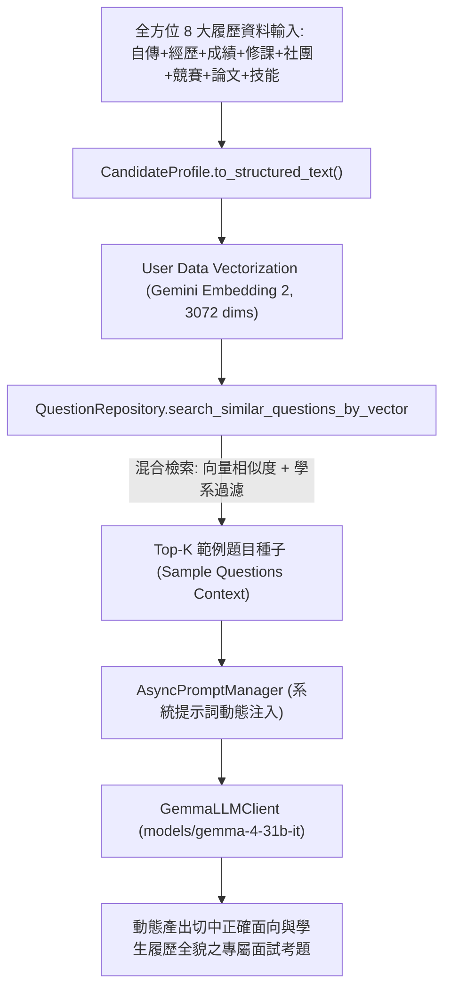

# 【Day 8】知識檢索：全方位履歷資料庫 Embedding 向量化、RAG 相似度比對與 Gemma-4-31B 出題引擎

在建立了 Day 7 的 Gemma-4-31B Chat Client、非同步 System Prompt 管理器與資安 Guardrail 之後，今天我們完成第二階段的關鍵樞紐——**全方位履歷資料庫向量化 (Candidate Profile Embedding)、RAG 相似度比對與動態題目生成引擎 (RAGRetrieverService)**。

本系統的文本生成 LLM **嚴格且唯一採用專屬開源旗艦模型 `models/gemma-4-31b-it`**。系統透過將學生的「**全方位 8 大履歷面向**（自傳、經歷、學業成績、修課紀錄、社團幹部、專案競賽、得獎紀錄、專題論文/研究成果及證照技能）」進行結構化清洗，並以 **Gemini Embedding 2 進行 3,072 維度向量化**，下探至擁有 2,045 筆 pre-embedded 向量資料庫進行餘弦相似度 (Cosine Similarity) 檢索，抽取出最適切的「範例題目種子 (Sample Questions Seed Context)」，交由 Gemma-4-31B-it 模型實時動態合成全新且專屬的面試考題。

---

## 1. 全方位履歷資料結構模型 (`CandidateProfile`)

收錄備審履歷中的 8 大核心維度，並提供結構化格式化輸出：

```python
class CandidateProfile(BaseModel):
    target_school: str = Field(default="")
    target_major: str = Field(default="")
    autobiography: str = Field(default="")
    experiences: List[str] = Field(default_factory=list)
    academic_performance: str = Field(default="")
    coursework: List[str] = Field(default_factory=list)
    club_leadership: List[str] = Field(default_factory=list)
    projects_and_awards: List[str] = Field(default_factory=list)
    thesis_and_research: str = Field(default="")
    certifications_and_skills: List[str] = Field(default_factory=list)

    def to_structured_text(self) -> str:
        """將 8 大履歷面向合成可進行向量化與 Prompt 注入的文本"""
        parts = [
            f"【目標校系】{self.target_school} {self.target_major}",
            f"【自傳摘要】{self.autobiography}" if self.autobiography else "",
            f"【歷程經歷】{'; '.join(self.experiences)}" if self.experiences else "",
            f"【學業成績】{self.academic_performance}" if self.academic_performance else "",
            f"【修課紀錄】{'; '.join(self.coursework)}" if self.coursework else "",
            f"【社團幹部】{'; '.join(self.club_leadership)}" if self.club_leadership else "",
            f"【專案競賽】{'; '.join(self.projects_and_awards)}" if self.projects_and_awards else "",
            f"【專題論文】{self.thesis_and_research}" if self.thesis_and_research else "",
            f"【證照技能】{'; '.join(self.certifications_and_skills)}" if self.certifications_and_skills else ""
        ]
        return "\n".join([p for p in parts if p.strip()])
```

---

## 2. RAG 雙層向量與過濾檢索架構設計 (RAG Architecture)



---

## 3. RAG 檢索器與向量比對引擎 (`RAGRetrieverService`)

```python
class RAGRetrieverService:
    async def retrieve_sample_questions_for_candidate(
        self, candidate_profile: Union[str, CandidateProfile], target_major: Optional[str] = None, top_k: int = 3
    ) -> List[Dict[str, Any]]:
        """非同步估算 Candidate Profile 向量並進行向量比對"""
        profile_text = candidate_profile.to_structured_text() if isinstance(candidate_profile, CandidateProfile) else str(candidate_profile)
        query_text = f"目標學系: {target_major or ''}。\n【全方位履歷歷程】\n{profile_text}"
        
        query_vec = await asyncio.to_thread(embedding_service.embed_query, query_text)
        return question_repository.search_similar_questions_by_vector(query_vec=query_vec, department=target_major, top_k=top_k)

    async def generate_rag_question_for_candidate(
        self, candidate_profile: Union[str, CandidateProfile], target_school: str = "", target_major: str = "", **kwargs
    ) -> Dict[str, Any]:
        """端到端 RAG 出題：向量檢索 ➔ 注入 Prompt ➔ Gemma 4 生成專屬題目"""
        sample_qs = await self.retrieve_sample_questions_for_candidate(candidate_profile, target_major=target_major)
        rag_seed_context = self.format_rag_context_seeds(sample_qs)

        generated_question = await gemma_client.invoke_with_system_prompt(
            prompt_name="question_generation",
            target_school=target_school,
            target_major=target_major,
            candidate_profile=candidate_profile.to_structured_text() if isinstance(candidate_profile, CandidateProfile) else str(candidate_profile),
            sample_questions=rag_seed_context,
            **kwargs
        )
        return {"generated_question": generated_question, "rag_seed_questions": sample_qs}
```

---

## 4. Pytest 單元與整合測試驗證

```text
tests/test_rag_service.py::test_candidate_profile_model_structured_text PASSED               [ 25%]
tests/test_rag_service.py::test_full_resume_candidate_profile_vectorization PASSED            [ 50%]
tests/test_rag_service.py::test_rag_similarity_search_retrieval_with_candidate_profile PASSED [ 75%]
tests/test_rag_service.py::test_end_to_end_rag_question_generation_with_full_candidate_profile PASSED [100%]

============================== 4 passed in 26.14s ==============================
```

---

## 結語與明天預告

今天我們完成了涵蓋 **8 大核心履歷面向** 的全方位 RAG 檢索器與 User 資料向量化比對服務。

明天 **【Day 9】**，我們將進行 **LLM Client 429 退避重試與滑動視窗對話上下文管理**！
