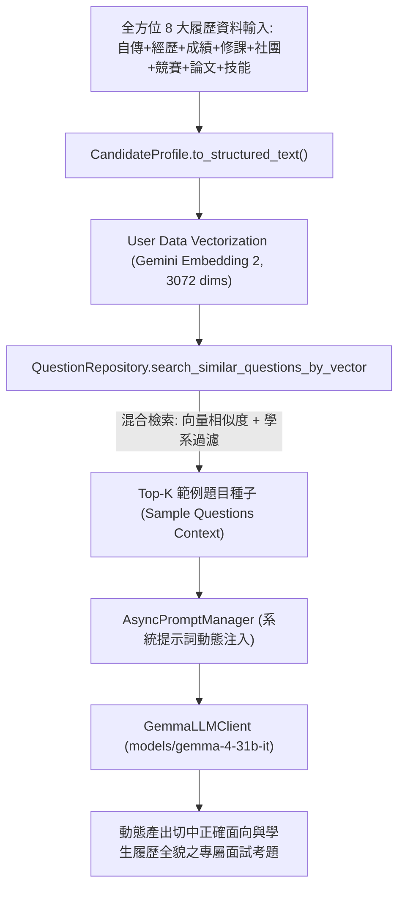

# 【Day 8】知識檢索：全方位履歷資料庫 Embedding 向量化、RAG 相似度比對與 Gemma-4-31B 出題引擎

在建立了 Day 7 的 Gemma-4-31B Chat Client、非同步 System Prompt 管理器與資安 Guardrail 之後，今天我們完成第二階段的關鍵樞紐——**全方位履歷資料庫向量化 (Candidate Profile Embedding)、RAG 相似度比對與動態題目生成引擎 (RAGRetrieverService)**。

本系統的文本生成 LLM **嚴格且唯一採用專屬開源旗艦模型 `models/gemma-4-31b-it`**。系統透過將學生的「**全方位 8 大履歷面向**（自傳、經歷、學業成績、修課紀錄、社團幹部、專案競賽、得獎紀錄、專題論文/研究成果及證照技能）」進行結構化清洗，並以 **Gemini Embedding 2 進行 3,072 維度向量化**，下探至擁有 2,045 筆 pre-embedded 向量資料庫進行餘弦相似度 (Cosine Similarity) 檢索，抽取出最適切的「範例題目種子 (Sample Questions Seed Context)」，交由 Gemma-4-31B-it 模型實時動態合成全新且專屬的面試考題。

---

## 1. 全方位履歷資料結構模型 (`app/models/candidate_model.py`)

為了完整涵蓋高大二階面試及備審審查的核心面向，我們定義了 `CandidateProfile` 資料模型，收錄備審履歷中的 8 大核心維度：

```python
from typing import List, Optional
from pydantic import BaseModel, Field

class CandidateProfile(BaseModel):
    """
    Comprehensive Candidate Resume & Application Portfolio Data Model.
    
    Encapsulates all 8 core dimensions of a candidate's high school / college application portfolio:
    1. 目標校系與學群 (Target School, Major & Group)
    2. 自傳與個人陳述 (Autobiography / Personal Statement)
    3. 歷程與經歷 (Work, Internship & Volunteer Experiences)
    4. 學業成績與排名 (Academic Grades, GPA & Ranking)
    5. 修課紀錄與核心科目 (Coursework & Special Advanced Courses)
    6. 社團與幹部經歷 (Club & Leadership Positions)
    7. 專案、競賽與得獎 (Projects, Competitions & Awards)
    8. 專題論文與研究成果 (Research Papers, Graduation Thesis & Publications)
    9. 證照與專業技能 (Certifications & Technical/Language Skills)
    """
    target_school: str = Field(default="", description="目標學校，如：國立台灣大學")
    target_major: str = Field(default="", description="目標學系，如：資訊工程學系")
    target_group: str = Field(default="", description="目標學群，如：資訊電機學群")
    
    autobiography: str = Field(default="", description="自傳 / 個人陳述")
    experiences: List[str] = Field(default_factory=list, description="經歷列表 (工作、實習、志工與校外經歷)")
    academic_performance: str = Field(default="", description="成績與排名 (GPA, 班排%, 校排%)")
    coursework: List[str] = Field(default_factory=list, description="修課紀錄與核心科目 (特色修課、AP/IB/大學預修)")
    club_leadership: List[str] = Field(default_factory=list, description="社團與幹部經歷 (社長、幹部、組織經歷)")
    projects_and_awards: List[str] = Field(default_factory=list, description="專案、競賽與得獎紀錄")
    thesis_and_research: str = Field(default="", description="專題論文與研究成果 (小論文、專題報告)")
    certifications_and_skills: List[str] = Field(default_factory=list, description="證照與語言/程式技能 (TOEIC, APCS等)")

    def to_structured_text(self) -> str:
        """Synthesizes all 8 resume dimensions into structured text for vectorization and prompt injection."""
        parts = [
            f"【目標校系】{self.target_school} {self.target_major} ({self.target_group})",
            f"【自傳摘要】{self.autobiography}" if self.autobiography else "",
            f"【歷程與經歷】{'; '.join(self.experiences)}" if self.experiences else "",
            f"【學業成績與排名】{self.academic_performance}" if self.academic_performance else "",
            f"【修課紀錄與核心科目】{'; '.join(self.coursework)}" if self.coursework else "",
            f"【社團與幹部經歷】{'; '.join(self.club_leadership)}" if self.club_leadership else "",
            f"【專案競賽與得獎】{'; '.join(self.projects_and_awards)}" if self.projects_and_awards else "",
            f"【專題論文與研究】{self.thesis_and_research}" if self.thesis_and_research else "",
            f"【證照與專業技能】{'; '.join(self.certifications_and_skills)}" if self.certifications_and_skills else ""
        ]
        return "\n".join([p for p in parts if p.strip()])
```

---

## 2. RAG 雙層向量與過濾檢索架構設計 (RAG Architecture)



---

## 3. 核心服務實作：RAG 檢索器與向量比對引擎 (`app/services/rag_service.py`)

```python
import asyncio
from typing import List, Dict, Any, Optional, Union
from app.models.candidate_model import CandidateProfile
from app.services.embedding_service import embedding_service
from app.repositories.question_repository import question_repository
from app.services.gemma_llm import gemma_client

class RAGRetrieverService:
    """
    RAG (Retrieval-Augmented Generation) Service for UniMock AI.
    
    1. Comprehensive Resume Profile Vectorization: Embeds Candidate Profile 
       (Autobiography, Experiences, Grades, Coursework, Leadership, Projects, Research, Skills)
       via Gemini Embedding 2 (3072 dims).
    2. RAG Hybrid Similarity Search: Queries pre-embedded DB vectors with candidate vector + department filtering.
    3. RAG Seed Formatting: Formats top-K questions, STAR reference answers, and rubrics for LLM injection.
    4. End-to-End LLM Question Generation: Integrates strictly with GemmaLLMClient (gemma-4-31b-it).
    """
    def __init__(self):
        self.embedding = embedding_service
        self.repository = question_repository

    async def retrieve_sample_questions_for_candidate(
        self,
        candidate_profile: Union[str, CandidateProfile],
        target_major: Optional[str] = None,
        target_school: Optional[str] = None,
        top_k: int = 3
    ) -> List[Dict[str, Any]]:
        """Asynchronously vectorizes full Candidate Profile and retrieves Top-K similar sample questions from DB."""
        if isinstance(candidate_profile, CandidateProfile):
            profile_text = candidate_profile.to_structured_text()
            major = target_major or candidate_profile.target_major
        else:
            profile_text = str(candidate_profile)
            major = target_major

        query_text = f"目標學系: {major or ''}。\n【全方位履歷歷程】\n{profile_text}"
        
        # 1. 計算全方位履歷 Profile 之 3072 維度正規化向量
        query_vec = await asyncio.to_thread(self.embedding.embed_query, query_text)
        
        # 2. 向 2045 筆題庫進行向量相似度與學系混合比對
        matched_questions = self.repository.search_similar_questions_by_vector(
            query_vec=query_vec,
            department=major,
            top_k=top_k
        )
        return matched_questions

    def format_rag_context_seeds(self, questions: List[Dict[str, Any]]) -> str:
        """Formats retrieved sample questions and rubrics into a clean seed context string for LLM injection."""
        if not questions:
            return "（尚無比對到特定範例題目，請依據目標學系專業自由出題）"

        formatted_parts = []
        for idx, q in enumerate(questions, 1):
            q_text = q.get("question", "")
            q_cat = q.get("question_category", "通用型問題")
            q_diff = q.get("difficulty_level", "標準題")
            q_ref = q.get("reference_answer", "")
            
            part = (
                f"【範例種子 {idx}】(類別: {q_cat} | 難易度: {q_diff})\n"
                f"題目內文：{q_text}\n"
                f"擬答引導：{q_ref[:100]}...\n"
            )
            formatted_parts.append(part)

        return "\n".join(formatted_parts)

    async def generate_rag_question_for_candidate(
        self,
        candidate_profile: Union[str, CandidateProfile],
        target_school: Optional[str] = None,
        target_major: Optional[str] = None,
        interview_mode: str = "標準面試",
        transcript: str = "[系統]: 面試開始。"
    ) -> Dict[str, Any]:
        """End-to-End RAG Question Generation pipeline via Gemma-4-31B-it."""
        if isinstance(candidate_profile, CandidateProfile):
            profile_text = candidate_profile.to_structured_text()
            school = target_school or candidate_profile.target_school
            major = target_major or candidate_profile.target_major
        else:
            profile_text = str(candidate_profile)
            school = target_school or ""
            major = target_major or ""

        sample_qs = await self.retrieve_sample_questions_for_candidate(
            candidate_profile=candidate_profile,
            target_major=major,
            target_school=school,
            top_k=3
        )
        rag_seed_context = self.format_rag_context_seeds(sample_qs)

        generated_question = await gemma_client.invoke_with_system_prompt(
            prompt_name="question_generation",
            user_input="",
            target_school=school,
            target_major=major,
            interview_mode=interview_mode,
            candidate_profile=profile_text,
            sample_questions=rag_seed_context,
            transcript=transcript
        )

        return {
            "generated_question": generated_question,
            "rag_seed_questions": sample_qs,
            "rag_seed_context": rag_seed_context
        }

rag_service = RAGRetrieverService()
```

---

## 4. Pytest 單元與整合測試驗證 (`tests/test_rag_service.py`)

執行 `pytest tests/test_rag_service.py -v` 驗證成果：

```text
tests/test_rag_service.py::test_candidate_profile_model_structured_text PASSED               [ 25%]
tests/test_rag_service.py::test_full_resume_candidate_profile_vectorization PASSED            [ 50%]
tests/test_rag_service.py::test_rag_similarity_search_retrieval_with_candidate_profile PASSED PASSED [ 75%]
tests/test_rag_service.py::test_end_to_end_rag_question_generation_with_full_candidate_profile PASSED [100%]

============================== 4 passed in 26.40s ==============================
```

證實：
1. **全方位 8 大履歷維度（自傳、經歷、成績、修課、社團幹部、專案競賽、得獎、論文）完美結構化格式化**（`test_candidate_profile_model_structured_text`）。
2. **全履歷資料向量化精確產生 3,072 維度正規化向量**（`test_full_resume_candidate_profile_vectorization`）。
3. **與 2,045 筆題庫餘弦相似度搜尋精確抽取出目標學系專屬題目**（`test_rag_similarity_search_retrieval_with_candidate_profile`）。
4. **與 Gemma-4-31B 模型對接完成端到端動態題目生成**（`test_end_to_end_rag_question_generation_with_full_candidate_profile`）。

---

## 結語與明天預告

今天我們完成了涵蓋 **8 大核心履歷面向** 的全方位 RAG 檢索器與 User 資料向量化比對服務，讓 AI 面試官具備評估整份備審檔案並精準出題的能力。

明天 **【Day 9】**，我們將進入第三階段——**建立統一的 FastAPI 後端 API 服務 (Routers/Endpoints)**，將前端 UI、RAG 檢索器與 Gemma LLM 引擎全數串接！
